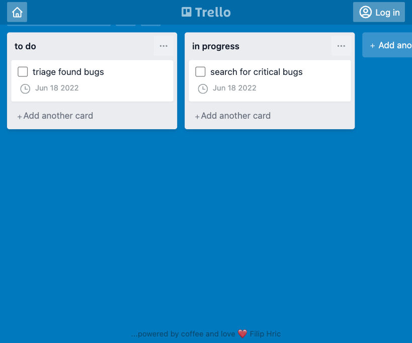

This is a blog post made from a talk I gave at Front end test fest, so if you want to watch a video about it, [feel free to do so on this link](http://front-endtestfest.com/6gm).

On my Discord server, I sometimes encounter a common pattern when answering questions. There are certain sets of problems that tend to surface repeatedly and for these, I created this blog post. Let’s jump into them!

## #1: Using explicit waiting
This first example feels kinda obvious. Whenever you added an explicit wait to your Cypress test, I believe you had an unsettling feeling about this. But what about the cases when our tests fail because the page is too slow? Feels like using `cy.wait()` is the way to go.

```js
// ❌ incorrect way, don’t use

cy.visit('/')
cy.wait(10000)
cy.get('button') 
  .should('be.visible')
```

But this makes our test just sit there and hope that the page will get loaded before the next command. Instead, we can make use of Cypress’ built-in retryability.
```js
cy.visit('/')
cy.get('button', { timeout: 10000 })
  .should('be.visible')
```
So why is this better? Because this way, we will wait maximum 10 seconds for that `button` to appear. But if the button renders sooner, the test will immediately move on to the next command. This will help you save some time. If you want to read more about this, I recommend [checking out my blog on this topic](/waiting-in-cypress-and-how-to-avoid-it).

## #2: Using unreadable selectors
I could write a whole article just on the topic of selectors ([in fact, I did](/cypress-basics-selecting-elements)), since this is one of the most dealt-with topics for testers. Selectors can be the first thing that can give us a clue as to what our test is doing. Because of that, it is worth making them readable.

[Cypress has some recommendations](https://docs.cypress.io/guides/references/best-practices#Selecting-Elements) as to which selectors should be used. The main purpose of these recommendations is to provide stability for your tests. At the top of the recommendations is to use separate `data-*` selectors. You should add these to your application.

However (and unfortunately IMHO), testers don’t always have the access to the tested application. This makes selecting elements quite a challenge, especially when the element we are searching for is obscure. Many that find themselves in this situation reach for various strategies for selecting elements.

One of these strategies is using **xpath**. [The big caveat of xpath is that their syntax is very hard to read](/cypress-basics-xpath-vs-css-selectors). By merely looking at your xpath selector, you are not really able to tell what element you are selecting. Moreover, they don’t really add anything to the capabilities of your Cypress tests. Anything xpath can do you can do with Cypress commands, and make it more readable.

```js [❌ selecting elements using xpath]
// Select an element by text
cy.xpath('//*[text()[contains(.,"My Boards")]]')
// Select an element containing a specific child element
cy.xpath('//div[contains(@class, "list")][.//div[contains(@class, "card")]]')
// Filter an element by index
cy.xpath('(//div[contains(@class, "board")])[1]')
// Select an element after a specific element
cy.xpath('//div[contains(@class, "card")][preceding::div[contains(., "milk")]]')
```

```js [✅ selecting elements using cypress commands]
// Select an element by text
cy.contains('h1', 'My Boards')
// Select an element containing a specific child element
cy.get('.card').parents('.list')
// Filter an element by index
cy.get('.board').eq(0)
// Select an element after a specific element
cy.contains('.card', 'milk').next('.card')
```

## #3: Selecting elements improperly
Consider the following scenario. You want to select a card (the white element on the page) and assert its text. 



Notice how both of these elements contain the word "bugs" inside. Can you tell which card are we going to select when using this code?

```js
cy,visit('/board/1')
cy.get('[data-cy=card]')
  .eq(0)
  .should('contain.text', 'bugs')
```

You might be guessing the first one, with the text "triage found bugs". While that may be a good answer it’s not the most precise one. Correctly it is - whichever card will load first.

It is important to remember that whenever a Cypress command finishes doing its job, it will move on to the next command. So once an element is found by the `.get(`)` command, we will move to the `.eq(0)` command. After that, we will move to our assertion that will fail.

You might wonder why Cypress does not retry at this point, but it actually does. Just not the whole chain. By design, `.should()` command will [retry the previous command, but not the whole chain](https://twitter.com/filip_hric/status/1493964887336251394). This is why it is vital to implement a better test design here and add a "guard" for this test. Before we assert the text of our card, we’ll make sure that all cards are present in DOM:

```js {3}
cy,visit('/board/1')
cy.get('[data-cy=card]')
  .should('have.length', 2)
  .eq(0)
  .should('contain.text', 'bugs')
```
## 4#: Ignoring requests in your app
Let’s take a look at this code example:
```js
cy.visit('/board/1')
cy.get('[data-cy=list]')
  .should('not.exist')
```
When we open our page, multiple requests get fired. Responses from these requests will get digested by the frontend app and rendered into our page. In this example `[data-cy=list]` elements get rendered after we get a response from `/api/lists` endpoint.

But the problem with this test is, that we are not telling Cypress to wait for these requests. Because of this, our test may give us a false positive and pass even if there are lists present in our application.

Cypress will not wait for the requests our application does automatically. We need to define this using the intercept command:

```js
cy.intercept('GET', '/api/lists')
  .as('lists')
cy.visit('/board/1')
cy.wait('@lists')
cy.get('[data-cy=list]')
  .should('not.exist')
```

## #5: Overlooking DOM re-rendering
Modern web applications send requests all the time to get information from the database and then render them in DOM. In our next example, we are testing a search bar, where each keystroke will send a new request. Each response will make the content on our page re-render.
In this test, we want to take a search result and confirm that after we type the word "for", we will see the first item with the text "search for critical bugs". The test code goes like this:

```js
cy.realPress(['Meta', 'k'])
cy.get('[data-cy=search-input]')
  .type('for')
cy.get('[data-cy=result-item]')
  .eq(0)
  .should('contain.text', 'search for critical bugs')
```

This test will suffer from "element detached from DOM" error. The reason for this is that while still typing, we will first get 2 results, and when we finish, we’ll get just a single result. In a result, our test will go like this:
1. "f" key is typed in the search box
2. request searching for all items with "f" will fire
3. response comes back and app will render two results
4. "o" key is typed in the search box
5. request searching for all items with "fo" will fire
6. response comes back and app will render two results
7. "r" key is typed in the search box
8. request searching for all items with "for" will fire
9. Cypress is done with typing, so it moves to the next command
10. Cypress will select `[data-cy=result-item]` elements and will filter the first one (using `.eq(0)`) command
11. Cypress will assert that it has the text "search for critical bugs"
12. since the text is different, it will run the previous command again (`.eq(0)`)
13. while Cypress is retrying and going back and forth between `.eq(0)` and `.should()` a response from our last request comes back and app will re-render to show single result
14. the element that we selected in step 10 is no longer present, so we get an error

Remember, `.should()` command will make the previous command retry, but not the full chain. This means that our `cy.get('[data-cy=result-item]')` does not get called again. To fix this problem we can again add a guarding assertion to our code to first make sure we get the proper number of results, and then assert the text of the result.

```js {5}
cy.realPress(['Meta', 'k'])
cy.get('[data-cy=search-input]')
  .type('for')
cy.get('[data-cy=result-item]')
  .should('have.length', 1)
  .eq(0)
  .should('contain.text', 'search for critical bugs')
```

But what if we cannot assert the number of results? [I wrote about this in the past](/testing-lists-of-items), but in short, the solution is to use `.should()` command with a callback, something like this:

```js {5-7}
cy.realPress(['Meta', 'k'])
cy.get('[data-cy=search-input]')
  .type('for')
cy.get('[data-cy=result-item]')
  .should( items => {
    expect(items[0].to.have.text('search for critical bugs'))      
  })
```

## #6: Creating inefficient command chains
Cypress has a really cool chaining syntax. Each command passes information to the next one, creating a one-way flow of your test scenario. But even these commands have an internal logic inside them. Cypress commands can be either parent, child or dual. This means, that some of our commands will always start a new chain.

Consider this command chain:

```js
cy.get('[data-cy="create-board"]')
  .click()
  .get('[data-cy="new-board-input"]')
  .type('new board{enter}')
  .location('pathname')
  .should('contain', '/board/')  
```

The problem with writing a chain like this is not only that it is hard to read, but also that it ignores this parent/child command chaining logic. Every `.get()` command is actually starting a new chain. This means that our `.click().get()` chain does not really make sense. Correctly using chains can prevent your Cypress tests from unpredictable behavior and can make them more readable:

```js
cy.get('[data-cy="create-board"]') // parent
  .click() // child
cy.get('[data-cy="new-board-input"]') // parent
  .type('new board{enter}') // child
cy.location('pathname') // parent
  .should('contain', '/board/') // child
```

## #7: Overusing UI
I believe that while writing UI tests, you should use UI as little as possible. This strategy can make your test faster and provide you the same (or bigger) confidence with your app. Let’s say you have a navigation bar with links, that looks like this:

```html
<nav>
  <a href="/blog">Blog</a>
  <a href="/about">About</a>
  <a href="/contact">Contact</a>
</nav>
```

The goal of the test will be to check all the links inside `<nav>` element, to make sure they are pointing to a live website. The intuitive approach might be using `.click()` command and then check either location or content of the opened page to see if the page is live.

However, this approach is slow and in fact, can give you false confidence. As I mentioned in one of my previous blogs, this approach can overlook that one of our pages is not live, but returns a 404 error.

Instead of checking your links like this, you can use `.request()` command to make sure that the page is live:

```js
cy.get('a').each( link => {
  cy.request(page.prop('href'))
})
```

## #8: Repeating the same set of actions
It’s really common to hear that your code should be DRY = don’t repeat yourself. While this is a great principle for your code, it seems like it is slightly ignored during the test run. In an example below, there’s a `cy.login()` command that will go through the login steps and will be used before every test:

```js
Cypress.Commands.add('login', () => {

  cy.visit('/login')
  
  cy.get('[type=email]')
    .type('filip+example@gmail.com')
  
  cy.get('[type=password]')
      .type('i<3slovak1a!')

  cy.get('[data-cy="logged-user"]')
    .should('be.visible')

})
```

Having this sequence of steps abstracted to a single command is definitely good. It will definitely make our code more "DRY". But as we keep using it in our test, our test execution will go through the same steps over and over, essentially repeating the same set of actions.

With Cypress you can pull up a trick that will help you solve this issue. This set of steps can be cached and reloaded using `cy.session()` command. This is still in an experimental state, but can be enabled using `experimentalSessionAndOrigin: true` attribute in your `cypress.config.js`. You can wrap the sequence in our custom command into `.session()` function like this:

```js {3, 14}
Cypress.Commands.add('login', () => {

  cy.session('login', () => {

    cy.get('[type=email]')
      .type('filip+example@gmail.com')
    
    cy.get('[type=password]')
      .type('i<3slovak1a!')

    cy.get('[data-cy="logged-user"]')
      .should('be.visible')

  })

})
```

This will cause to run the sequence in your custom commands just once per spec. But if you want to cache it throughout your whole test run, you can do that by using [cypress-data-session plugin](https://www.npmjs.com/package/cypress-data-session). There are a lot more things you can do this, but caching your steps is probably the most valuable one, as it can easily shave off a couple of minutes from the whole test run. This will of course depend on the test itself. In my own tests, where I just ran 4 tests that logged in, I was able to cut the time in half.

Hopefully, this helped. I’m teaching all this and more in my [upcoming workshop](/workshop/cypress-core). Hope to see you there!