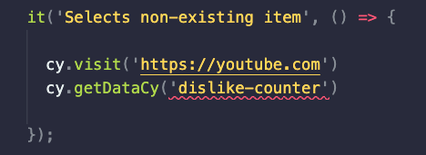
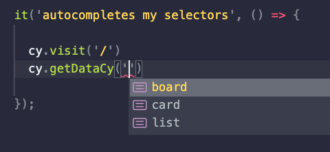

## You will learn:
- how to create custom command that will autocomplete your selectors
- how perform a check on your tests that are written in TypeScript
- how to grep selectors from your app
- how to create warning if there are selectors in your app that you are not using

Cypress advises to use data-cy selectors as a best practice for selecting your elements on page. Recently, we had a great discussion on our [discord server](https://filiphric.com/discord) about whether this is a good practice. Personally I strongly lean to "yes". If you are in this camp as well, I have some nice tips for you today.

## Using data-* selectors with custom commands
If you are using `data-*` selectors a lot, chances are you want to create a custom command.
```js
Cypress.Commands.add('getDataCy', (input) => {
  return cy.get(`[data-cy='${input}']`);
})
```
This way you can skip writing out `[data-cy='']` part, when you are using a `.get()` command. If you’d like to create a fancier version of this, I wrote about an article on this topic, explaining how you can [improve your logs for your custom command.](/improve-your-custom-command-logs-in-cypress#highlighting-elements)

When using TypeScript, you can further define what kind of input will our newly created custom function receive. Usually we could go for something simple, like `input: string`. But we can instead create our own type, which will limit what kind of input we can pass to our function.

```ts
type Selectors = 'board' | 'list' | 'card'

Cypress.Commands.add('getDataCy', (input: Selectors) => {
  return cy.get(`[data-cy='${input}']`);
})
```
This way, TypeScript will throw an error when we use a selector that is not allowed:



## Creating a selector file
The list of selectors might get quite big over time. That’s why it’s probably a good idea to keep it in a separate file. My approach is to create a `selectors.d.ts` file where I keep a list of all my selectors. I usually save this to the `cypress/support/@types/` folder.
```ts [cypress/support/@types/selectors.d.ts]
type Selectors = 
  | 'board'
  | 'list'
  | 'card'
  // ...
```
Whenever I add a new selector to my application, I need to add it to my list, otherwise I’ll get an error. On the other hand, when I use a selector that is already in the list, I get a nice autocomplete in VS Code.



## Checking the selectors
Of course, we can get into a situation where we might delete a selector from our list, and we wouldn’t notice until we open the test file, or our tests run. Since we are using TypeScript, we can create a `typecheck` script, which will check for any TypeScript errors. This script will use `--noEmit` flag, because don’t need to compile our files. This is done by Cypress when we run our tests.
```json [package.json]
// ...
"scripts": {
  "typecheck": "tsc --noEmit -p ."
}
// ...
```

Another thing we can do is to grep our selectors from our source code. This is of course a little tricky, because not all applications and frameworks work the same. In my [Trello app project](https://github.com/filiphric/trelloapp-vue-vite-ts), I have a script that will grep these from my `.vue` files inside the `src` folder.

```shell [scripts/getSelectors.sh]
#!/usr/bin/env bash

SRC_SELECTORS=$(grep -hro 'data-cy="[^"]*"' src | cut -d \" -f2 | sort | uniq)
```

I then use this very cluncky way of generating all of the selectors into the `cypress/support/@types/selectors.d.ts` file. But hey, it works for me so far! 😅
```shell [scripts/getSelectors.sh]
#!/usr/bin/env bash

SRC_SELECTORS=$(grep -hro 'data-cy="[^"]*"' src | cut -d \" -f2 | sort | uniq)
echo $SRC_SELECTORS | sed "s/ /'\n| '/g; s/^/&export type Selectors = \n| '/; s/.$/&'/;" | cat > cypress/support/@types/selectors.d.ts
```

This way, if any of my selectors from source code would be deleteed I would immediately notice when I run that `npm run typecheck` script.

## Finding unused data-cy selectors
I started having way too much fun with this, so decided to grep my tests too. Then, I would compare these selectors with the ones find in my source code and print out warning if there are any extra.

```shell [scripts/getSelectors.sh]
#!/usr/bin/env bash

# find all selectors in src folder
SRC_SELECTORS=$(grep -hro 'data-cy="[^"]*"' src | cut -d \" -f2 | sort | uniq)
# find all selectors in cypress folder
TEST_SELECTORS=$(grep -hro '.getDataCy([^"]*' cypress | cut -d \' -f2 | sort | uniq)

# compare selector lists
UNUSED_SELECTORS=$(comm -23 <(echo "$SRC_SELECTORS") <(echo "$TEST_SELECTORS"))

# if any found in src, print them our
if [[ $UNUSED_SELECTORS != "" ]]; then
echo -e "WARNING! There are some selectors in your app that are not being used:

$UNUSED_SELECTORS"
fi

# create selectors.d.ts from all selectors found in src
echo $SRC_SELECTORS | sed "s/ /'\n| '/g; s/^/&export type Selectors = \n| '/; s/.$/&'/;" | cat > cypress/support/@types/selectors.d.ts
fi
```

I imagine there are some better ways to approach this, as I’m not really a shell script expert. I have this script in my [Trello app project](https://github.com/filiphric/trelloapp-vue-vite-ts), feel free to add a comment or PR to improve this.

