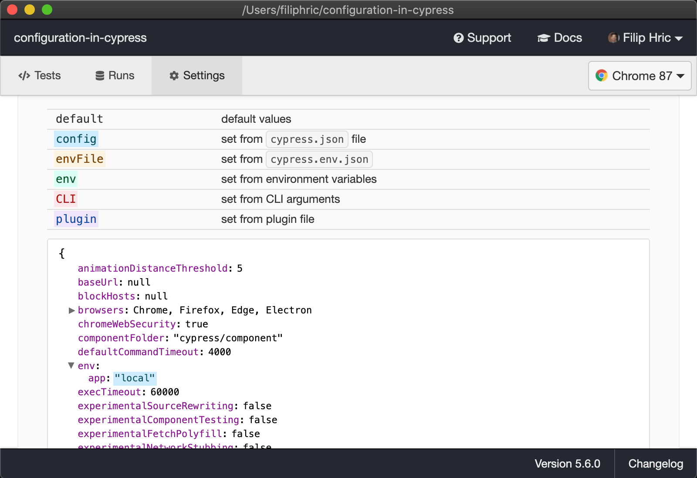
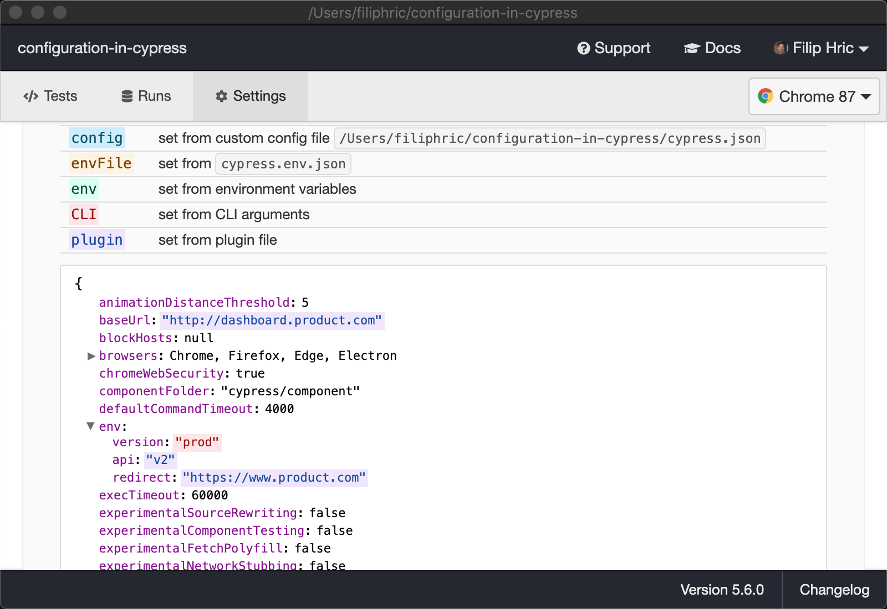
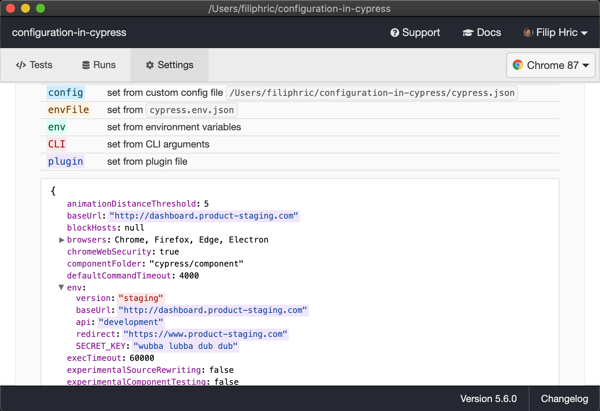

Last week I have been playing with configuration in Cypress. I find configuring different environments to be especially hard topic. Especially for people that are beginning. In this blog, I would like to break configuration into small steps, that will help you navigate this topic.

## Basics of configuration
Every Cypress project has a `cypress.config.js` file. In this file, you have an `env` attribute, that is usually filled with environment variables. Let's say I add a variable `app` to this attribute like this:
```js [cypress.config.js]{6}
import { defineConfig } from 'cypress'

export default defineConfig({
  e2e: {
    env: {
      app: "local"
    }
  }
})
```
When I now open Cypress in GUI mode, I can look into settings tab and see my config file being read, highlighted in blue.



As you can see from the screenshot, there are multiple ways to add your environment variables. You can add them with a `CYPRESS_` prefix to your environment or pass them through CLI as arguments. [Take a peek into the documentation](https://docs.cypress.io/guides/guides/environment-variables.html#Setting), where you can find examples of all these approaches.

## Writing a plugin
With more complicated setups, you might want to combine these approaches. Let’s say you have multiple environments, like `local`, `staging`, `preprod` and `prod`. Each of these has its own home url, its own version of api and its own redirect page. These configurations might look something like this:
```js
// local
baseUrl: 'http://localhost:3000'
api: 'development'
redirect: 'https://www.product-staging.com'

// staging
baseUrl: 'http://dashboard.product-staging.com'
api: 'development'
redirect: 'https://www.product-staging.com'

// preprod
baseUrl: 'http://dashboard-preprod.product.com'
api: 'v2'
redirect: 'https://www.product.com'

// prod
baseUrl: 'http://dashboard.product.com'
api: 'v1'
redirect: 'https://www.product.com'
```
As you can see this is kind of a mess. But this often happens in real life situations. You have got different combinations of APIs and URLs that differ from environment to environment. More than that, you may want to add some key or secret from environment that should not be in the codebase. Let’s dive into how we can solve this.

First of all, let’s see how the `setupNodeEvents` inside the `cypress.config.js` file works. Let’s show this on a simple example. We’ll add this piece of code and open Cypress via via `npx cypress open`

```js [cypress.config.js]
import { defineConfig } from 'cypress'

export default defineConfig({
  e2e: {
    env: {
      app: "local"
    },
    setupNodeEvents(on, config) {
      console.log(config.env)
    }
  }
})
```
When we open Cypress, we will see `{ app: 'local' }` logged out to our terminal.

Now let’s clear out our `cypress.config.js` and instead of this let’s pass a `version` flag via CLI to our environment, like this:
```bash
npx cypress open --env version="prod"
```
Upon opening Cypress, you would see `{ version: 'prod' }` logged out to our terminal. Let's now use this information and change our config according to what we pass in `version` flag.
```js [cypress.config.js]
import { defineConfig } from 'cypress'

export default defineConfig({
  e2e: {
    setupNodeEvents(on, config) {
      if (config.env.version === "prod") {
        config.baseUrl = 'http://dashboard.product.com'
        config.env.api = 'v2'
        config.env.redirect = 'https://www.product.com'
      }
      return config
    }
  }
})
```
Using `setupNodeEvents`, we are now adding some more variables to our env. When we look into our settings in Cypress CLI, you can see that our env variables have been added.



This helps demonstrate how creating dynamic configuration works. Let's now say that our configuration paths are stored in separate json files, for which we created a separate `config` folder in our Cypress project:

```treeview
cypress/
└── config/
    ├── local.json
    ├── staging.json
    ├── preprod.json
    └── prod.json
```
Let's now say, that for each `version` flag, we want to load a different file and pass it into Cypress as our config and environment. In order to do this, we can rewrite our config file like this:
```js [cypress.config.js]
import { defineConfig } from 'cypress'

export default defineConfig({
  e2e: {
    setupNodeEvents(on, config) {
      // if version not defined, use local
      const version = config.env.version || 'local'

      // load env from json
      const envConfig = require(`./config/${version}.json`)
      config.env = { ...config.env, ...envConfig }

      // change baseUrl
      config.baseUrl = envConfig.baseUrl

      return config
    }
  }
})
```
This way we can load whichever file we want and even add some more json files for different configurations. Whichever file we pass to our CLI will be read. Now we can take it a step further, and instead of using CLI flag, we will use Cypress environment variable like this:
```bash
cypress_version=preprod npx cypress open
```
As mentioned, anything passed to our CLI with prefix `cypress_` will be added as environment variable to Cypress. Notice how I pass these **before** `npx cypress open` as opposed to `--env` flag that is passed **after**.

## Handling secrets
There are probably couple of keys or secrets that you don't want to keep in your code base. You usually keep them in your `.bashrc` or `.zshrc` file, depending on what shell you use. Or you may use [dotenv plugin](https://www.npmjs.com/package/dotenv) to store your variables per project. This works too. To read these variables and use them in your tests, you can add following to your configuration:
```js [cypress.config.js]
import { defineConfig } from 'cypress'

export default defineConfig({
  e2e: {
    setupNodeEvents(on, config) {
      // if version not defined, use local
      const version = config.env.version || 'local'

      // load env from json
      const envConfig = require(`./config/${version}.json`)
      config.env = { ...config.env, ...envConfig }

      // change baseUrl
      config.baseUrl = envConfig.baseUrl

      // add a secret key
      config.env.SECRET_KEY = process.env.SECRET_KEY

      return config
    }
  }
})
```
When you open your tests now, you can see the `SECRET_KEY` being displayed in our project settings.

