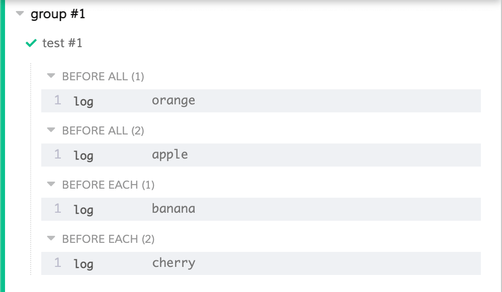

Hey! Welcome to another episode of Cypress basics. You can check out some other articles on my blog where I provide step by step explanations of some Cypress basics + some extra tips on how you can take things one step further. So far, I wrote about:

- [Selecting elements](/cypress-basics-selecting-elements)
- [Where did my cookies disappear?](/cypress-basics-where-did-my-cookies-disappear)
- [Check if element exists](/cypress-basics-check-if-element-exists)
- [Check attributes, value and text](/cypress-basics-check-attributes-value-and-text)
- [xpath vs. CSS selectors](/cypress-basics-xpath-vs-css-selectors)
- [Variables](/cypress-basics-variables)
- [API testing](/cypress-basics-api-testing)
- [Uploading a file](/cypress-basics-uploading-file)
  
## Basics - before() and beforeEach()
Let’s say you have a spec that has a couple of tests in it. In these tests you are opening a page and testing some functionality. Each time you want to open that page using `.visit()` command
```js
it('test #1', () => {

  cy.visit('/')
  // rest of your test

})

it('test #2', () => {

  cy.visit('/')
  // rest of your test

})
```
With couple of tests, things might get somehow repetitive. For this case, you might instead use a `before()` hook, that will open up your page before all of your tests:
```js

before(() => {

  cy.visit('/')

})

it('test #1', () => {
  // rest of your test
})

it('test #2', () => {
  // rest of your test
})
```
Bear in mind that [Cypress clears out the state of browser](https://docs.cypress.io/guides/core-concepts/test-isolation) in between tests. Coming with version 12, it even visits an empty page so that there’s a firm test isolation. There are ways to configure this behavior.

> One thing to note here - `test #2` should be independent on the result of `test #1`. If this is not the case, you will create a domino effect for all the tests in that spec. It is a good practice to isolate your tests in such a way that tests don’t affect each other. For this, you might find `beforeEach()` hook more useful. This may require you to structure your tests in a certain way, but will help you gain overall test stability.

## after() and afterEach()
Similarly to previous hooks, there’s a way to do an action before after your tests finish. It’s commonly used for doing a cleanup after your test is finish, which might look something like this:
```js
after(() => {

  resetDb()

})

it('test #1', () => {
  // your test
})

it('test #2', () => {
  // your test
})
```
This follows some good principles, as you clearly have a goal of cleaning up the data your tests generate. There are some reasons though, why you might want to reconsider using `after()` and `afterEach()` and use `before()` and `beforeEach()` instead.

First of all, when writing your test in GUI mode, after a test is finished, you can keep interacting with your page. With data deleted, you may lose that option as your data might no longer be available to you.

Second, the action that is happening in `after()` or `afterEach()` log might error. In that case, you may face a similar domino effect as described couple of paragraphs earlier.

There are of course situations where these hooks are very useful, like collecting data gathered from tests etc.

## Nested before() and beforeEach() hooks
Let’s now say you have multiple hooks and different `describe()` and `it()` blocks. This is where it might get a little confusing at first, but becomes very clear when you know how it works. Consider following code:
```js
before(() => {

  cy.log('orange')

})

beforeEach(() => {

  cy.log('banana')

})

describe('group #1', () => {

  before(() => {

    cy.log('apple')

  })

  beforeEach(() => {

    cy.log('cherry')

  })

  it('test #1', () => {
      // your test
  })

})
```

Do you know in what order will these logs be called? The correct answer is this:


Compare the order of which we have written these in our test and in which these tests are executed. I like to think of all hooks as being "squashed" together before executing a test or a `describe()` block.

## Using beforeEach block in support/index.js
Sometimes I like to use these blocks to run a "global" `beforeEach()` block that I want to run before all of my tests. I describe one case like this in my blog about [handling data from API](/working-with-api-response-data-in-cypress). I create a storage for myself, which I erase before each of my tests. I use my `support/index.js` file like this:
```js [support/index.js]
beforeEach(() => {

  Cypress.env('boards', []);
  Cypress.env('lists', []);

});
```
In my tests, I add data to these empty arrays as needed.

## What should you put in these blocks?
I like to think of these hooks as a preparation state of my test. I rarely put `.visit()` in there, which means more repetition, but a clearer view of what I am trying to do in my test. I often use these hooks to fire a couple of API requests, seed data, set authorization cookie or do some similar action that does not require app to be open in the browser. There’s a great post by a friend of mine, Martin Škarbala from kiwi.com about how you can speed up your tests by <a href="https://code.kiwi.com/skip-the-ui-using-api-calls-d358b9b61b91">skipping UI and use API instead</a>.

Hope this helped, if that was the case, pass it on and share it on your social networks. You’ll help my blog grow and I will be very thankful for that.

If you liked this article, more are coming! I write one every week so you can sign up for a newsletter at the bottom of this page and get notified once a new one is out.
