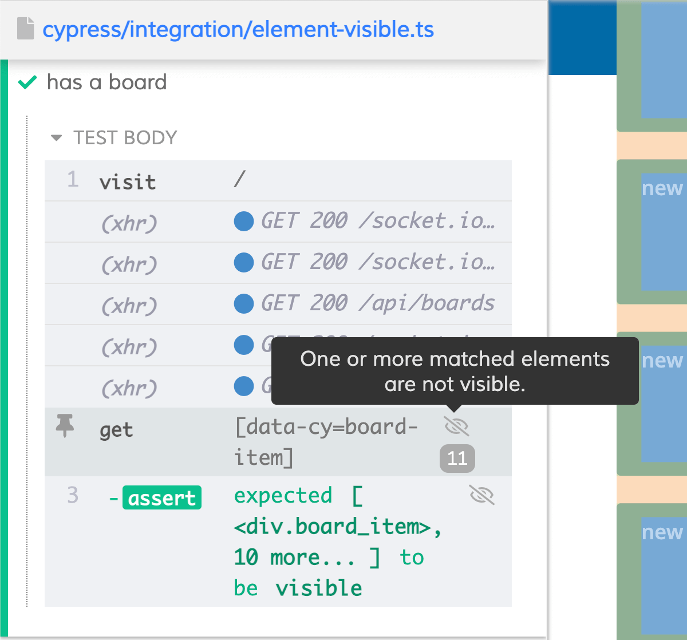

One of the first things you might want to test in your app with Cypress is element presence. In this article I’d like to take a look into how test if element exists, is visible and discuss some gotchas that might occur during some of these tests.

This article is a part of series on Cypress basics. You can check out some other articles on my blog where I provide step by step explanations of some Cypress basics + some extra tips on how you can take things one step further. So far, I wrote about:

- [Selecting elements](/cypress-basics-selecting-elements)
- [Where did my cookies disappear?](/cypress-basics-where-did-my-cookies-disappear)
- [before(), beforeEach(), after() and afterEach()](/cypress-basics-before-beforeeach-after-aftereach)
- [Check attributes, value and text](/cypress-basics-check-attributes-value-and-text)
- [xpath vs. CSS selectors](/cypress-basics-xpath-vs-css-selectors)
- [Variables](/cypress-basics-variables)
- [API testing](/cypress-basics-api-testing)
- [Uploading a file](/cypress-basics-uploading-file)

During this blog, I will be using my Trello clone app. You can <a href="https://github.com/filiphric/trelloapp">clone it from GitHub</a> and follow along with this blog.

## Check visibility
Let’s start with the simplest use case. On our page we have a list of boards. I’ll check the visibility of my board with following code:
```ts
it('has a board', () => {

  cy
    .visit('/');

  cy
    .get('[data-cy=board-item]')
    .should('be.visible');

});
```
Our test does the exact thing we would expect. It will check the visibility of our element and pass our test.


The interesting thing here is that although our element is rendered based on data from network, Cypress’ internal logic has automatic retries implemented, so it will actually wait for an element to render without us having to add any extra command. In other words, even if our element is not yet rendered at the moment of execution, Cypress will wait for it to render.

## Check non-visibility
Let’s now check the exact opposite. I will delete my board and check that it is not visible.
```ts {8}
it('has a board', () => {

  cy
    .visit('/');

  cy
    .get('[data-cy=board-item]')
    .should('not.be.visible');

});
```


Surprisingly, our test has failed now. This is because Cypress actually verifies that element is hidden via css property like `display: none` or `visibility: hidden`. But in our case, the element we are trying to assert is not even present in our app. That is why our assertion fails. Instead of visibility check, we should be doing an assertion of non-existence, so `.should('not.exist')`

Be careful with negative assertions though, because sometimes the reason for that might be that the element was not yet rendered because of a network lag etc. In case you want to assert that an element stops existing, I suggest you first check that the element is visible (or exists) first:
```ts
it('deletes a board', () => {

  cy
    .visit('/');

  cy
    .get('[data-cy=board-item]')
    .should('exist');

  cy
    .request('DELETE', '/boards/2626653025');

  cy
    .get('[data-cy=board-item]')
    .should('not.exist');

});
```

## Checking visibility on viewport
Let’s now create a long list of boards in my list. I will check visibility of all these. A slightly unexpected thing happens. My assertion still passes, but I will get a warning on my `.get()` command:



This is a good thing to have in mind when making assertions on multiple elements at once. It’s important to understand how an element is considered visible from perspective of browser. In our app, we have a container element that has a property `overflow: scroll`. If that wasn’t the case, Cypress would declare all my elements visible. Even the last one.

The difference that the `overflow: scroll` makes is actually important. Without it, my list would stretch as far as I need. Even though I couldn’t see all my elements because of my browser height, they would still be considered visible. But the case changes if I decide that user will need to scroll to see the elements that are overflowing the height of our container. Some elements may not be visible.

If placing elements on a page is an issue for your use case (e.g. you need to have your homepage to be pixel-perfect), I suggest rather testing this with a visual test. The human-eye definitions on visibility might be slightly different in cases like this.

That said, we can still check non-visibility of our last element, that is hidden from viewport:
```ts
it('has a board', () => {

  cy
    .visit('/');

  cy
    .get('[data-cy=board-item]')
    .last()
    .should('not.be.visible');

});
```
This test would pass. It is in fact not visible, because of that `overflow: scroll` property of our container.

The whole thing with visibility might be better explained with a simple demonstration. Let’s consider this test:
```ts
it('has a board', () => {

  cy
    .visit('/');

  cy
    .get('[data-cy=login-menu]')
    .click();

  cy
    .get('[data-cy=board-item]')
    .eq(1)
    .should('be.visible')
    .click();

});
```
Our test would not fail on line 13, but on line 14. Our `.should('be.visible')` assertion would be visible, since our element is not hidden by scroll, and it’s possible to see it. But the `.click()` action would in fact fail, because our board element is in fact covered by our login module.

Hope this helps. If you are still struggling with checking visibility, let me know on <a href="https://twitter.com/filip_hric/">Twitter</a> or <a href="https://www.linkedin.com/in/filip-hric-11a5b1126/">LinkedIn</a>. And If you want to talk Cypress, I suggest you join the <a href="https://bit.ly/cy-discord">Discord server</a>, where we talk about Cypress, share articles, tips and help each other grow.
