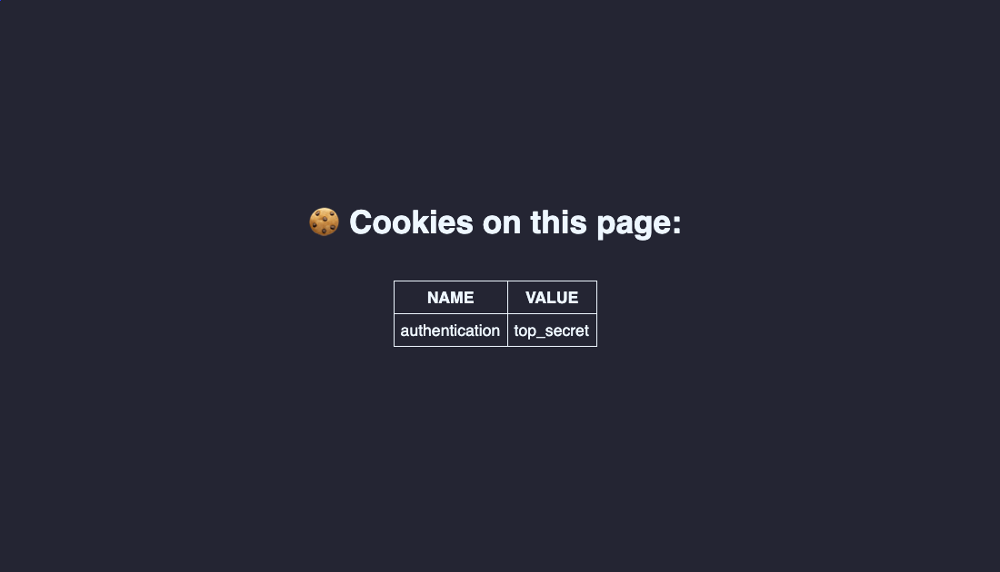

Hey! Welcome to another episode of Cypress basics. You can check out some other articles on my blog where I provide step by step explanations of some Cypress basics + some extra tips on how you can take things one step further. So far, I wrote about:

- [Selecting elements](/cypress-basics-selecting-elements)
- [Check if element exists](/cypress-basics-check-if-element-exists)
- [before(), beforeEach(), after() and afterEach()](/cypress-basics-before-beforeeach-after-aftereach)
- [Check attributes, value and text](/cypress-basics-check-attributes-value-and-text)
- [xpath vs. CSS selectors](/cypress-basics-xpath-vs-css-selectors)
- [Variables](/cypress-basics-variables)
- [API testing](/cypress-basics-api-testing)
- [Uploading a file](/cypress-basics-uploading-file)

You successfully logged into your application. You’ve got your first test! Now to the next one. Click! And now you are logged out. Why is Cypress logging you out after each test?!

The reason is actually simple. [Cypress clears out the state of browser](https://docs.cypress.io/api/commands/clearcookies.html#Syntax) in between tests. All your cookies are deleted from your app between each `it()` block. The reason why you are now logged out may be because your app uses a cookie to store authentication token. When your app makes an http request to your server, that cookie will be sent along with it. This way your server knows that you your authentication is valid and that you have the rights to read or write data. If the cookie is not present, server evaluates this as an unauthorized request and your app will typically log you out.

Clearing the state of the browser is actually a good thing, but you might be in a situation where you want to work around this. E.g. you want to group multiple tests in one spec, where each test requires you to be logged in. Let’s look into what are the options. As is often the case with my blogs, [I have a repo set up, so make sure you clone it](https://github.com/filiphric/cypress-cookies) and play with the code yourself. In our repo, we have a simple app, that lists all of the cookies that are present.



In our first piece of code you can see that we are setting a cookie to our app using `.setCookie()` command, but in our second test this cookie is not present anymore.

```js [/cypress/integration/twoCookieTests.ts]
it('should show cookie', () => {
  cy.setCookie('authentication', 'top_secret');
  cy.visit('../../app/index.html');
});

it('opens a page', () => {
  cy.visit('../../app/index.html');
});
```
Once you’ll run this spec, you’ll see that our page shows "no cookies were found" on our second spec. See video from the test run:


To make sure that our cookies are set in each test, you can set up your cookies before each test using `beforeEach` hook.
```js [/cypress/integration/beforeEach.ts] {1-3}
beforeEach(() => {
  cy.setCookie('authentication', 'top_secret');
});

it('first test', () => {
  cy.visit('../../app/index.html');
});

it('second test', () => {
  cy.visit('../../app/index.html');
});
```

This however may get a little annoying, so instead of using `beforeEach` hook we can use another approach. Using [Cypress’ Cookies API](https://docs.cypress.io/api/cypress-api/cookies.html#Defaults) we can set up cookies that we never want to delete. With `Cypress.Cookies.defaults` we can define which cookies we want to prevent from being cleared before each test:

```js [/cypress/integration/cypressApi.ts] {1-3}
Cypress.Cookies.defaults({
  preserve: 'authentication'
})

it('first test', () => {
  cy.setCookie('authentication', 'top_secret');
  cy.visit('../../app/index.html');
});

it('second test', () => {
  cy.visit('../../app/index.html');
});

```
Instead of using the api within out spec, I’d recommend declaring this in `support/index.js` file in Cypress project. This way you’ll make sure that your cookie is preserved throughout all of your tests. But maybe you don’t want to do that. Instead of keeping the cookie for the whole test suite, you might just want to preserve it for a single spec file.

For this, you can use Cookies API too. Using `Cypress.Cookies.preserveOnce` will enable you to keep your cookies for your spec. In our following test, we are using `before()` hook to set up our cookie and then `beforeEach()` hook to call our `preserveOnce` function to keep that cookie present for each test:
```js {7-9}
before(() => {
  cy.setCookie('authentication', 'top_secret');
});

beforeEach(() => {
  Cypress.Cookies.preserveOnce('authentication')
});

it('first test', () => {
  cy.visit('../../app/index.html');
});

it('second test', () => {
  cy.visit('../../app/index.html');
});
```
This may not seem too different from just using `beforeEach()` to add our cookies before tests. However, this example is quite oversimplified. Most of the time the case is not just setting a cookie inside our browser, but actually logging in with a custom command or via API. This may be a more expensive operation, and avoiding repetition might save us some time. I’ll talk about different ways of authenticating to our app in some future blog, so make sure you subscribe to the newsletter to be notified when that comes out.
