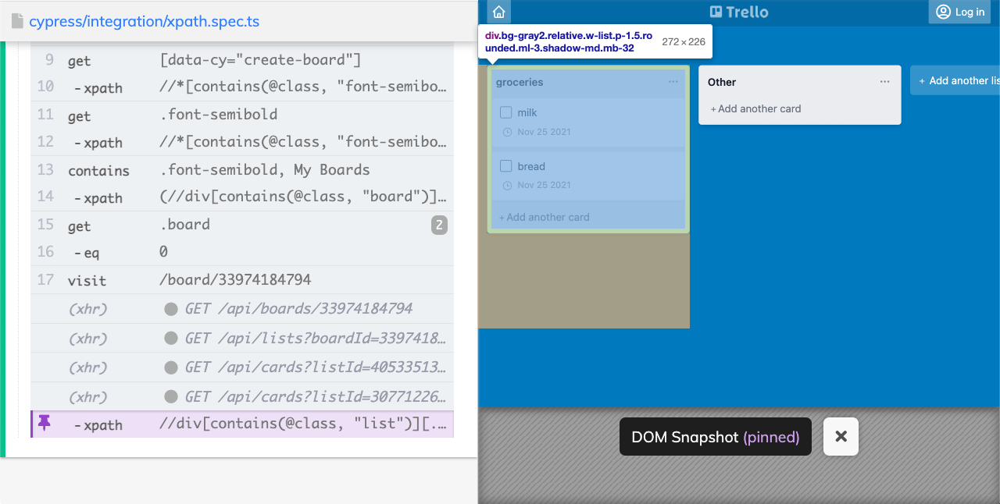

This article is a part of series on Cypress basics. You can check out some other articles on my blog where I provide step by step explanations of some Cypress basics + some extra tips on how you can take things one step further. So far, I wrote about:

- [Selecting elements](/cypress-basics-selecting-elements)
- [Where did my cookies disappear?](/cypress-basics-where-did-my-cookies-disappear)
- [Check if element exists](/cypress-basics-check-if-element-exists)
- [before(), beforeEach(), after() and afterEach()](/cypress-basics-before-beforeeach-after-aftereach)
- [Check attributes, value and text](/cypress-basics-check-attributes-value-and-text)
- [Variables](/cypress-basics-variables)
- [API testing](/cypress-basics-api-testing)
- [Uploading a file](/cypress-basics-uploading-file)

Let me start right of the bat stating that I’m not the biggest fan of [xpath selectors](https://developer.mozilla.org/en-US/docs/Web/XPath). In my opinion, they are hard to read, and provide little benefits in comparison to CSS selectors or data-* attributes. With jQuery bundled into Cypress, you can select your elements in a much more readable way. However, they are widely used and a go-to choice for projects where you don’t have access to the source code. That’s why it’s useful to have knowledge on how to use them.

## Cypress and xpath
To use xpath selectors, you must first [install a plugin](https://github.com/cypress-io/cypress-xpath). It is an official plugin maintained by Cypress. The installation is pretty standard. Just `npm install -D cypress-xpath` to install the package. 

You then have to add `require('cypress-xpath')` to your `cypress/support/index.js` file. Without this, your plugin is not registered and you will get `cy.xpath is not a function` error.

If you are using TypeScript, don’t forget to add `cypress-xpath` to your types in `tsconfig.json`file.

This will add an `.xpath()` command, which works similarly to `.get()` command. It will return an HTML element which you can then interact with. Let’s look into a couple of xpath examples and compare them to selector usage with Cypress commands.

As is usuall with my blog, you can check out the working code in my repository branch.

## Cypress vs. xpath examples
### Select the whole document
```ts
cy.xpath('/html')
cy.root()
```

### Select an element by text
```ts
cy.xpath('//*[text()[contains(.,"My Boards")]]')
cy.contains('My Boards')
```

### Select a specific element by text
```ts
cy.xpath('//h1[contains(.,"My Boards")]')
cy.contains('h1', 'My Boards')
```

### Select an element by attribute
```ts
cy.xpath('//*[@data-cy="create-board"]')
cy.get('[data-cy="create-board"]')
```

### Select an element that contains a class
```ts
cy.xpath('//*[contains(@class, "font-semibold"]')
cy.get('.font-semibold')
```
Important side note here. This xpath will match any substring in the class attribute, that means that if we had an element with a class name `button_font-semibold` it would also be matched by this xpath selector.

### Select an element with specific class, by text
```ts
cy.xpath('//*[contains(@class, "font-semibold")][text()[contains(.,"My Boards")]]')
cy.contains('.font-semibold', 'My Boards')
```

### Filter an element by index
```ts
cy.xpath('(//div[contains(@class, "board")])[1]')
cy.get('.board').eq(0)
```
Notice that xpath does not use the numbering from 0, as is often used in other languages, but starts numbering from number 1.

### Select a child element
```ts
cy.xpath('//div[contains(@class, "list")]//child::div[contains(@class, "card")]')
cy.get('.list').find('.card')
```

### Select an element containing a specific child element
```ts
cy.xpath('//div[contains(@class, "list")][.//div[contains(@class, "card")]]')
cy.get('.card').parents('.list')
```
In this example, we want to select only the list that contains some cards:



### Select an element after a specific element
```ts
cy.xpath('//div[contains(@class, "card")][preceding::div[contains(., "milk")]]')
cy.contains('.card', 'milk').next('.card')
```

### Select an element before a specific element
```ts
cy.xpath('//div[contains(@class, "card")][following::div[contains(., "bread")]]')
cy.contains('.card', 'bread').next('.card')
```
Hope this helps. I’ll be updating this post to sShare this with your friends if you feel like someone can learn from this, I’d greatly appreciate this.

If you want to learn more about selecting elements, I recommend checking out my other articles on [selecting elements](/cypress-basics-selecting-elements), [autocompleting selectors](/autocompleting-selectors-in-cypress-with-typescript) or a very powerful [.contains() command](/contains-an-overlooked-gem-in-cypress). Additionally, if you work with xpath, I recommend checking out [Sanjay Kumar’s SelectorsHub tool](https://selectorshub.com/testcase-studio/).
