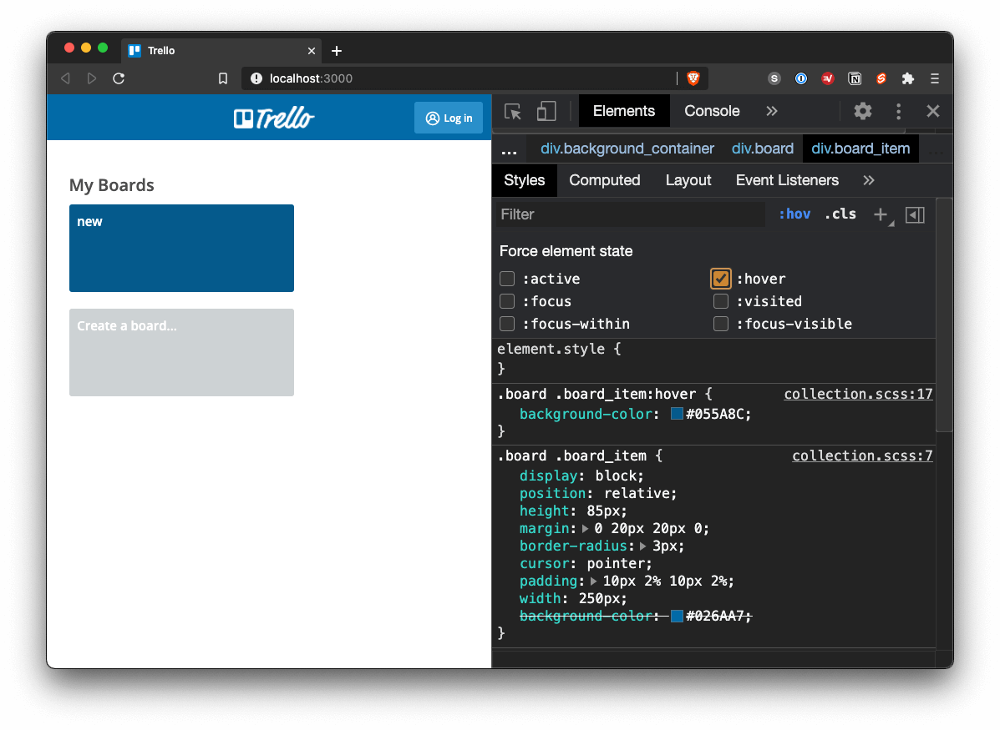
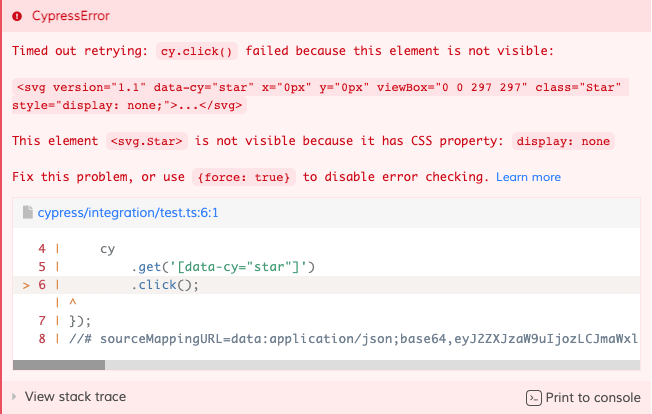

If you looked at [Cypress documentation](https://on.cypress.io/hover) and looked for .hover() command, you might get a little disappointed. There is no such command. Even worse, .hover() is the [oldest issue on Cypress’ GitHub page](https://github.com/cypress-io/cypress/issues?q=is%3Aissue+is%3Aopen+sort%3Acreated-asc) that is still open. So no hover in Cypress? Well, this would be a short post if there wasn’t a solution 😃.

I will be using my Trello clone app, so make sure you [clone it on GitHub](https://github.com/filiphric/trelloapp) if you want to follow along. Let’s take a look onto our board list and see what happens when we hover over a board.


Our board card gets darker and a star icon appears on top right corner. Upon further examination, you can see that these two changes are triggered differently. Looking at DevTools, you can see that the color change is handled by CSS, but our icon is not displayed when we force hover state via DevTools:



Instead, there is an event listener that will change the visibility of our star icon.


User of course does not see this. The functionality here enables user to bookmark a board, so that’s what we need to focus on in our test. Let’s now try to write a test, in which we attempt to mimic this user behavior.
```ts
cy
  .visit('/')

cy
  .get('[data-cy="star"]')
  .click();
```
This will of course throw an error, because the element we want to click on is not visible. Cypress has some great explanatory error messages, with some recommendations on how to solve the problem.



As a quick fix, we can apply `.click({force: true})` to skip checks that Cypress does for us before we click on an element. There’s a really good article on [what this means in Cypress docs](https://docs.cypress.io/guides/core-concepts/interacting-with-elements.html#Actionability). Of course, there are many reasons you might not want to skip these checks.

If we want to avoid this, we can use `.invoke()` command. This enables us to display a hidden element, same way you would using jQuery `.show()` function. In fact, `.invoke()` command enables you to use many of jQuery functions. The code will look something like this:
```ts
cy
  .visit('/')

cy
  .get('[data-cy="star"]')
  .invoke('show')
  .click();
```
This way, we don’t need to force our click, because our icon will be visible.

You may argue, that we are manipulating our application to a state that user does not really get into. And you would be right. Our icon is not displayed by user invoking a function on the icon element, but by hovering over our board item. As described above, there are event listeners bound to our item, called `mouseover` and `mouseout`. Instead of forcing our icon to show, we can trigger these events onto our board item.

With using a `.trigger()` command, our code will look something like this:
```ts
cy
  .visit('/');

cy
  .get('[data-cy="board-item"]')
  .trigger('mouseover')

cy
  .get('[data-cy="star"]')
  .click();
```
This comes closer to our real-world scenario, as our icon is shown when a `mouseover` event is fired. Note that this event is not the same thing as CSS `:hover` state. When you run this test, you can see that the board item does not change color. Since this is change is handled by CSS, there is no real way we can trigger this change using JavaScript.

Luckily, there is a way to trigger a real hover state by accessing Chrome DevTools protocol. To make things easier, awesome [Dmitriy Kovalenko](https://twitter.com/dmtrKovalenko) has created a [Cypress plugin](https://github.com/dmtrKovalenko/cypress-real-events) that handles accessing this protocol. Installation of this plugin is pretty standard and readme file should get you through it. This plugin will add 4 new commands:
```ts
cy.realClick()
cy.realHover()
cy.realPress()
cy.realType()
```
Using the `.realHover()` command enables us to properly hover over our board item. Our test will look something like this:
```ts
cy
  .visit('/');

cy
  .get('[data-cy="board-item"]')
  .realHover()
  .should('have.css', 'background-color', 'rgb(5, 90, 140)');

cy
  .get('[data-cy="star"]')
  .click();
```
In our test, we can now actually check the changed color of our board item. That’s pretty cool. Note that this plugin only works in Chrome-based browsers, so you may need to skip this test while running in Firefox.

If you enjoyed this article, consider sharing it with your friends on your favorite social network. More great content is coming, so you may want to subscribe my to newsletter or follow me on [YouTube](https://www.youtube.com/channel/UCDOCAVIhSh5VpJMEfdak1OA) and [Twitter](https://twitter.com/filip_hric/).
