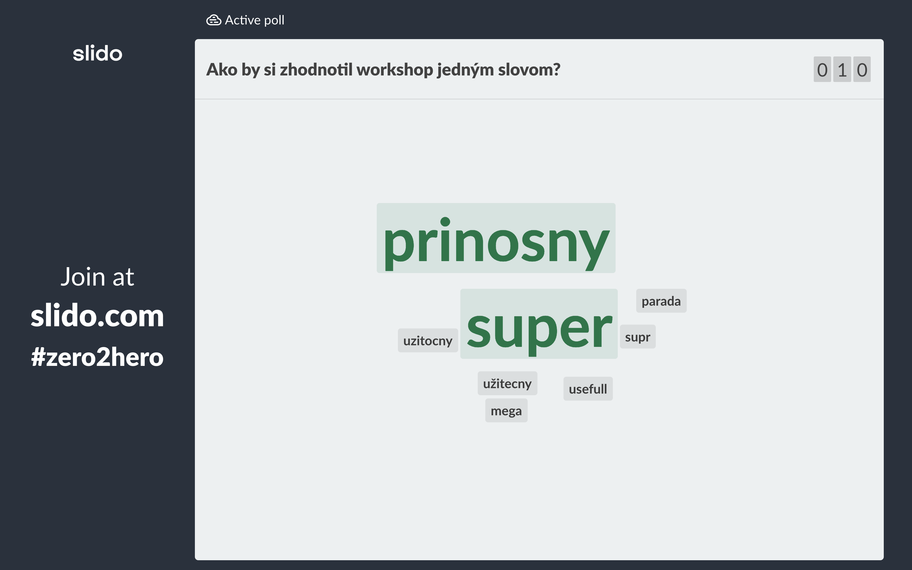

I had a chance to do a Cypress workshop at this year’s [TestCrunch in Brno](https://www.testcrunch.cz/2019/prednaska/5). It was an amazing experience. I knew I loved teaching, but I never thought I’d enjoy it this much. The format of a hands-on workshop is truly an amazing experience, and the most cool thing about this — it’s a different story every time.

That said, there we some rough edges I hope to smooth in the future. Here I my learnings, hope this helps you in your future workshop.

## Preparation, preparation, preparation

No matter how big of an expert you (think) are on presented topic, you need to prepare. Good preparation gives you a good structure, that provides you some anchoring points. If participants ask questions (and it’s a sign you are doing a great job when they do), you often get sidetracked. Good structure helps you decide on answering a question immediately, or leaving it for later, so you can discuss it in more depth afterwards.

***Extra tip:*** Don’t hide your table of contents. It helps participants time their questions well or give them a frame on when their question is going to be answered if postponed.

## Learn from the best

I often thought of doing a workshop on Cypress and I failed at creating a good structure. Luckily, folks at Cypress have prepared a workshop that I was able to [download right from GitHub](https://github.com/cypress-io/testing-workshop-cypress). It helped me create my own version more easily. But more importantly I learned how to pace workshop in a way that makes the learning experience smooth.

***Extra tip:*** Divide every part of your workshop into theoretical, practical and discussion part. This helps you provide information, encourage learning by doing, and then share those learnings or answer questions at the end.

## Prepare for troubleshooting

During my workshop on Cypress, we have spent quite a long time installing node, git, figuring out command line and debugging problems. This was not really a comfortable part. I was a little stressed, participants were frustrated (but determined nevertheless, which was nice) or bored. Next time I’d definitely reach out to participants beforehand and ask them to try to do the installations on their own. If that would fail, I’d give the option to come in early and provide help, so that I save some time and move more quickly to the fun stuff.

As a Mac user, I found myself in a room full of Windows users. I realized, I have never used command line on a windows computer and at one point I have advised to use ls command — which of course did nothing. In hindsight, I think I should have done a workshop dry run at home, or on someone else’s computer.

**Extra tip:** Use knowledge of others. Participants can help each other, so the pressure is not all on you. Encourage participants to discuss problems, especially in practical parts. I’ve seen this being done amazingly by [Gleb Bahmutov](https://twitter.com/bahmutov) -himself at a workshop he held in Bratislava.

## Ask for feedback, regularly

There is always a potential threat of missed opportunity when information flows only in one direction. Engage in conversation with your participants. They can give you a great feedback on what they understand and what needs to be explained better. The fear of asking stupid question is especially present during workshops. I like to use Slido and create some polls, especially for the purpose of asking about which part was hardest to understand. Participants can vote anonymously. After votes come in, I point out that I understand why this topic in particular can be hard to understand. And 100% of the times, I really do. This usually gives participants the confidence to speak up when I ask them to elaborate more on what’s unclear, creating a safe environment for any type of question.

**Extra tip:** I gained a lot of great learnings from [blog that my colleague wrote on webinars](https://blog.sli.do/9-tips-engaging-webinars/). I realized running a webinar isn’t all that different from running a workshop and a lot of the same principles apply. If you’d like to see me doing a webinar, [you can find a recording here](https://www.cypress.io/blog/2019/08/16/webcast-recording-from-zero-to-hero-with-cypress/).

## Summary

As I said — this was an amazing experience to me and participants left me some very nice feedbacks:

*Some feedbacks from participants: useful, amazing, beneficial,...*

I hope my blog will help you in doing *your* workshops. Any other tips? Feedbacks? [Tweet at me](https://twitter.com/filip_hric)!
