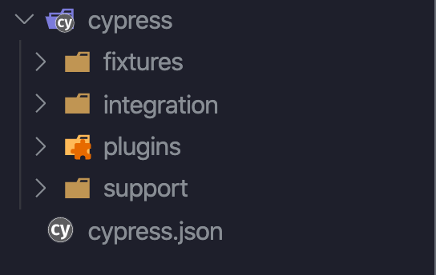

That’s what we needed, right? Another VS code extension blog 😂 But I guess I got your attention, so why not share a little bit of my workflow? This one is for all you testers and developers writing tests in Cypress.

## [Add .only](https://marketplace.visualstudio.com/items?itemName=ub1que.add-only)

Here’s to the lazy ones among us 🍻 [Add .only](https://marketplace.visualstudio.com/items?itemName=ub1que.add-only) extension does exactly what it claims to do. It filters your test by adding .only keyword to your it() block. It’s about 1 second faster than typing it yourself. Use that time well.

## [ES6 Mocha Snippets](https://marketplace.visualstudio.com/items?itemName=spoonscen.es6-mocha-snippets)

This plugin actually saves you more than 1 second, and maybe even a couple of minutes. Depends on how many tests you write. [These snippets](https://marketplace.visualstudio.com/items?itemName=spoonscen.es6-mocha-snippets) help you create a quick describe() or it() block, and can create a combination of these two for you. You can quickly create a before() or beforeEach() hook. And after() too. [But don’t use that one.](https://docs.cypress.io/guides/references/best-practices.html#Using-after-or-afterEach-hooks)

## [Fold plus](https://marketplace.visualstudio.com/items?itemName=dakara.dakara-foldplus)

With many tests in one spec, you might want to look into just the names of your tests. If you wan’t to fold all your it() blocks, you might find [Fold plus extension](https://marketplace.visualstudio.com/items?itemName=dakara.dakara-foldplus) really useful. Works something like this.

## [Bracket pair colorizer](https://marketplace.visualstudio.com/items?itemName=CoenraadS.bracket-pair-colorizer-2)

With all the different code blocks, it is easy to get lost in all the brackets. If you are like me, and like to move stuff around, chances are you will forget a bracket pair spend couple of days trying to find out which one is missing (or extra). With [highlighting code blocks](https://marketplace.visualstudio.com/items?itemName=CoenraadS.bracket-pair-colorizer-2), it may take a little less.

*EDIT: With newer versions of VS Code, you get colorizing brackets feature out of the box which makes this extension deprecated.*

## [vscode-icons](https://marketplace.visualstudio.com/items?itemName=vscode-icons-team.vscode-icons)

[Just a nice little addition](https://marketplace.visualstudio.com/items?itemName=vscode-icons-team.vscode-icons) to your VS code. To keep things organized different folders get different icons. Cypress-related files and folder get a nice little Cypress icon, so you can find them more easily.

