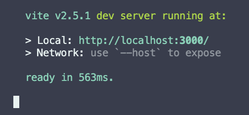
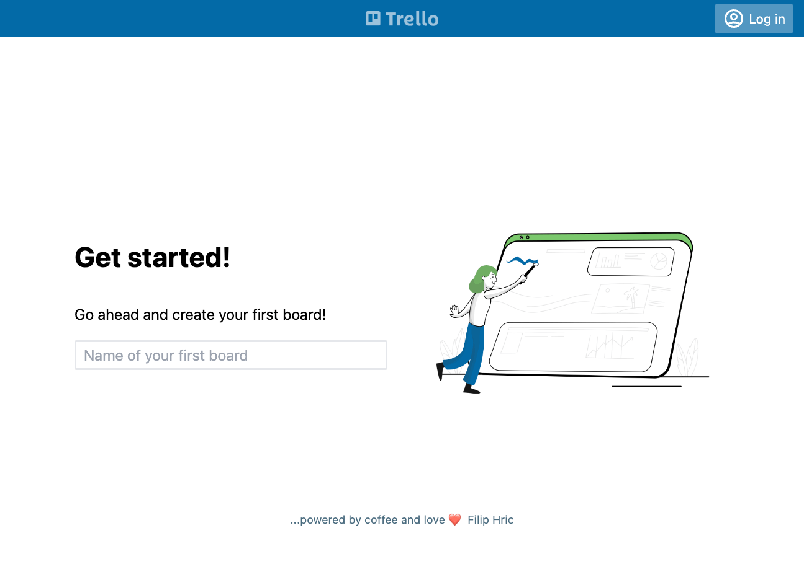
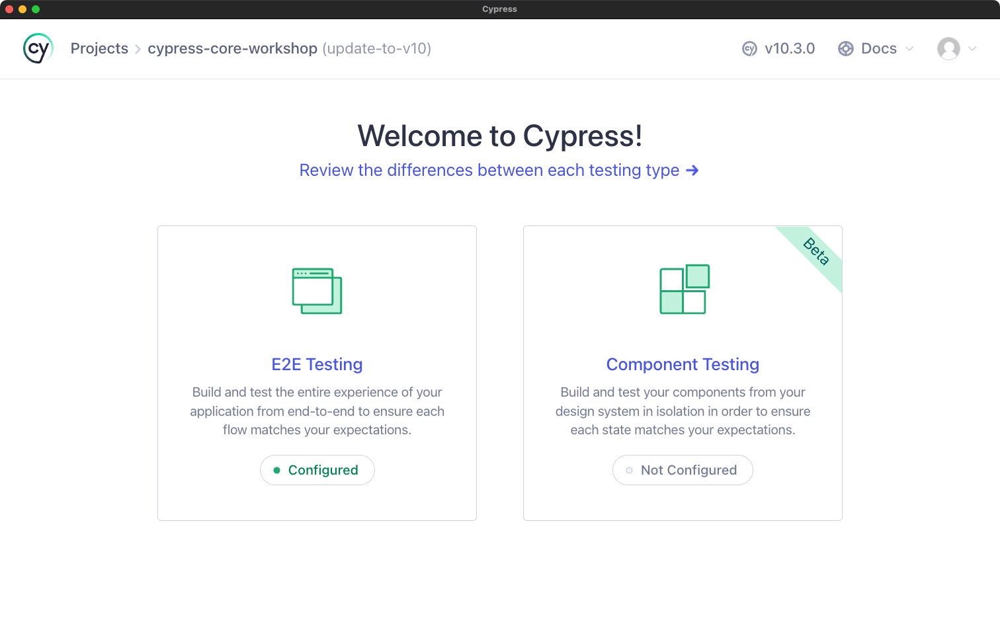

## Installation
Once you cloned the repository and used `npm install` to install the app, you should be able to run `npm start` command. Here is a step by step guid on how to run the app and troubleshoot it.

It’s best if you use a text editor for this. I will be using VS Code for the workshop, [which you can download here](https://code.visualstudio.com/download). 

## Making sure the application is running
Open the workshop repository folder and in the top bar click on "Terminal" and choose "New Terminal".
If you have gone through the initial steps (clone, install), you should be able to run the app with `npm start` command. Make sure you are opening the terminal in the workshop folder (you can check that by typing "pwd" into your command line). You should see the following message and be able to see the application in your browser on url http://localhost:3000 

You should see a running application that looks something like this:


## Running Cypress

Open a new terminal window in your editor and open Cypress using one of these commands:
```plaintext
npx cypress open
```

```plaintext
npm cy:open
```

If at least one of them works, great 👍 You should see a window like this:  



## Troubleshooting
If one or more checks don’t work, please reach out to me. We can make a call and solve it. It is necessary to solve all the problems before the workshop, otherwise it might be hard to get back on track. Here are couple of tips for most common issues:

### `git clone` command does not work 
If you see a message like this:
```plaintext
Fatal error: git is not installed or not in the PATH
```
there’s a good chance you don’t have git installed. [Installation instructions are here](https://git-scm.com/book/en/v2/Getting-Started-Installing-Git). If everything fails, there is an alternative way. Visit the repository site, click the arrow next to the green "code" button and pick the option "download zip". Unzip the project, open it in VS Code and continue with the `npm install` step

### `npm install` command does not work
You see the error:
```plaintext
node: command not found
```
In this case, it is possible you don’t have node.js installed. Please go to [https://nodejs.org](https://nodejs.org) and install node.js according to the installation instructions. There’s a good chance you’ll need to restart VS Code after the installation

### `npm start` throws an error 
There are two possible errors here:
1. if you see an error similar to `Error: Cannot find module 'worker_threads'` then it is possible you have an older version of Node.js installed. Try checking that by typing the `node -v` command into your terminal. If it returns version older than v14, please go to [https://nodejs.org](https://nodejs.org) and install latest version of Node.js 
2. if you see an error like `'vite' is not recognized as an internal or external command` it may be that the installation didn’t go properly for Trello app. Use your terminal to go to `trelloapp` folder and trigger installation from that folder by using following commands:
```plaintext
cd trelloapp
npm install
```

### `npx cypress open` throws an error
You see something like: `Command timed out after 30000 milliseconds` - in this case, try repeating the command or turn off your VPN (if you have one). Cypress does a verification check when opened for the first time. If this takes longer than 30 seconds it will time out. 
You can also try to run the command like this: `CYPRESS_VERIFY_TIMEOUT=60000 npx cypress open` and increase the timeout

## Contact me
If for any reason something is not working, feel free to contact me via email, or DM me through [LinkedIn](http://www.linkedin.com/in/filip-hric), [Twitter](https://twitter.com/filip_hric/) or [Discord](https://filiphric.com/discord)