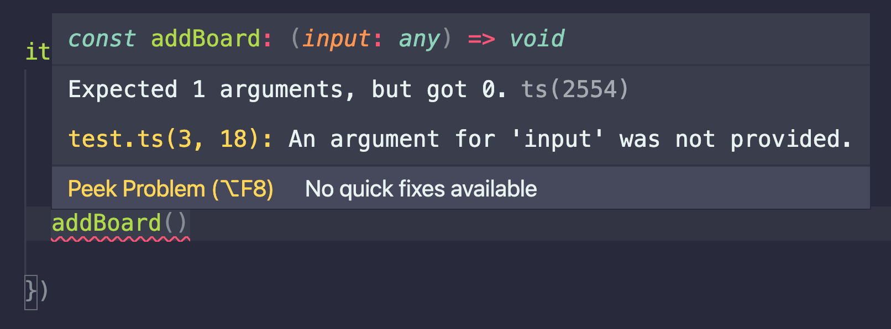
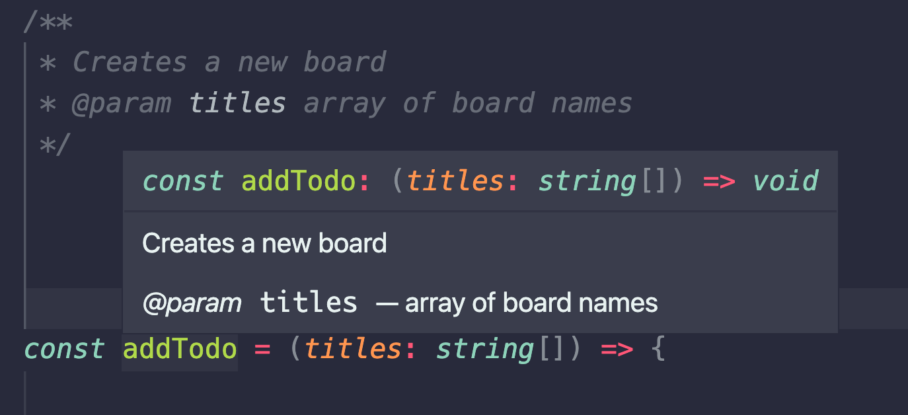

TypeScript has been gaining popularity over last couple of years, and for good reason. It enables developers to create their own types. This helps creating less mistakes and self documenting code. In this article, I’ll show you the basics of TypeScript.

## Simple use of Typescript in Cypress
Let’s start with a simple example. As is usual, I’m going to be using my Trello clone app, [which you can fork on GitHub](https://github.com/filiphric/trelloapp). In the following code, I have a very simple set of steps. I open my app and create new board:

```js
/// <reference types="cypress" />

it('creating a board', () => {

  cy
    .visit('/')

  cy
    .get('[data-cy="create-board"]')
    .click();

  cy
    .get('[data-cy=new-board-input]')
    .type('new board{enter}');

})
```

Since creating a new board is a pretty common action in my tests, I want to pull lines 8-14 into a separate function. This function will be able to take an argument so that we can customize the board name as we use the function.

```js
/// <reference types="cypress" />

const addBoard = (input) => {
  cy
    .get('[data-cy="create-board"]')
    .click();

  cy
    .get('[data-cy=new-board-input]')
    .type(`${input}{enter}`);
}

it('creating a board', () => {

  cy
    .visit('/')

  addBoard()

})
```

You might notice, looking at the code, that I left my `.addBoard()` function empty. Since I did not input any text, my test would fail. My app does not allow creating a board with empty name. Let’s now simply switch the extension name from `.js` to `.ts` and see what happens in our text editor.



As you can see, our function now shows an error in our editor. I made the screenshot while hovering over our underlined function. VS Code has provided an explanation - our function expects to have at least one argument, but none were provided.

Nothing is actually preventing us from running this code. But with TypeScript, we get an instant feedback on the validity. Once we see the error, we can easily fix it, by providing our function with an argument.

Let’s now play with this a little. With TypeScript, you can define what kind of input we want to accept. Since we obviously want the argument to be a string, let’s define a type, by writing it like this:
```ts
const addBoard = (input: string) => {
  cy
    .get('[data-cy="create-board"]')
    .click();

  cy
    .get('[data-cy=new-board-input]')
    .type(`${input}{enter}`);
}

it('creating a board', () => {

  cy
    .visit('/')

  addBoard('new board')

})
```
Now that we have specified a type of our argument, we’ll get an error every time we would try to pass anything else, like boolean or number. For this particular function, it does not seem like much, but imagine a function that will call an API endpoint with bunch of different stuff in it’s payload, like arrays, objects, strings and numbers. We can have types for all that too.

## Let’s play with types
The options for setting types are really vast. So far I’ve been really just scratching surface since I’m also still learning about this. There’s a lot to learn about TypeScript, so let’s play and experiment. For example, I’d like to change my function in a way that it only takes a certain text.

```ts
const addBoard = (input: 'new board' | 'my board') => {
  cy
    .get('[data-cy="create-board"]')
    .click();

  cy
    .get('[data-cy=new-board-input]')
    .type(`${input}{enter}`);
}
```
By adding this, I can specify which types of input will my function take. What’s even nicer, VS Code provides me with autocomplete:


I can imagine there might be some very cool use cases for this. Not sure why, but `data-cy` attribute selectors come to mind immediately. I have this `getDataCy` command,that is just a simple wrapper around Cypress `.get()` command. It will select element based on `data-cy` attribute so I don’t have to type the whole `[data-cy=selector]` text all the time. What if I could autocomplete my selectors? 🤔 If I find out this would be something useful, I’ll let you know on this blog, subscribe down at the bottom of the page if you are interested.

Let’s now say I want to add multiple boards with this function. Inside the function, I will loop through the array of strings and add all the boards I need. Instead of a single string, we want to be able to input an array of strings instead.

```ts
const addTodo = (titles: string[]) => {

  titles.forEach(title => {

    cy
      .get('[data-cy="create-board"]')
      .click();

    cy
      .get('[data-cy=new-board-input]')
      .type(`${title}{enter}`);

  })

}
```
Whenever I will add something else to my `addTodo` function instead of array, I will get an error as I type it. So before even running my test, I get a feedback that the way I’m using this function is not valid. This helps tremendously with typos, incorrect types or forgotten commas.

If your project already uses TypeScript, there’s a good chance that a big part of your project already contains types. You might be able to reuse your types from your app inside your tests. I imagine that in a strict type checking, a change in the app might trigger an error in tests right away.

## Using JSDoc
There’s another cool TypeScript feature, which you can use even with pure JavaScript. With JSDoc, you can add documentation to your functions. In VS Code, you can add your documentation by typing `/** */`. This will create a special comment, that will pop out once you hover over your function.



There are many different flags, like `@param` to give explanation for your parameters `@example` to provide a whole example of usage for that command or `@deprecated` to mark that command as soon to be obsolete. You can see JSDoc being used with Cypress commands too where they even show a link to a documentation. Imagine using these for your custom commands or your page objects and giving them instant context.

## Setting up TypeScript in your project

Let’s back up a little. So far, what we have done is just change our file extension from `.js` to `.ts`. But before we would be able to run these tests in Cypress, there are still two more things we need to do. Cypress documentation has a [really nice article on this](https://docs.cypress.io/guides/tooling/typescript-support.html). To sum it up, you need to do is to install TypeScript via `npm` or `yarn`, and then create a `tsconfig.json`

```json {5}
{
  "compilerOptions": {
    "target": "es5",
    "lib": ["es5", "dom"],
    "types": ["cypress"]
  },
  "include": [
    "**/*.ts"
  ]
}
```

Just copying and pasting this into your project should get you started, but there are tons of options on how to configure this file. Notice how on line 5, we are defining types. This is the exact thing as adding `/// <reference types="cypress" />` at the beginning of your file to make autocomplete work. With TypeScript, you don’t need to do that, because it will be enabled globally.

## Creating a custom command
Let’s now pull our `addBoard()` function out of our file and create a custom Cypress command. We will then be able to use it across our project.

```ts [support/commands/addBoard.ts]
Cypress.Commands.add('addBoard', (input: string) => {
  cy
    .get('[data-cy="create-board"]')
    .click();

  cy
    .get('[data-cy=new-board-input]')
    .type(`${input}{enter}`);
})
```

This is all nice, but just adding this command will not start autocompleting it when I try to use it in my test. For that, I need to expand the `cy` object.

There are two ways to do this. The first way can be found in mentioned documentation. All you need to do is to create a definitions file, with the extension `.d.ts` and declare your command there:

```ts [support/commands.d.ts]
declare namespace Cypress {
  interface Chainable {
    addBoard(value: string): void
  }
}
```
There’s a lot to unpack here, but I don’t really want to go into too much detail. Simply put, we are adding our `addBoard` Cypress command into a Cypress interface. The `void` at the end of our function just means that our function will not pass anything on. If we wanted, it could return a selected element or a response body from API call, all depending on what we do with the function.

The second way to add a custom command is to add the definition right inside our custom command. The file will look like this:

```ts [support/commands/addBoard.ts]
declare global {
  namespace Cypress {
    interface Chainable {
      addBoard: typeof addBoard;
    }
  }
}

export const addBoard = (input: string) => {
  cy
    .get('[data-cy="create-board"]')
    .click();

  cy
    .get('[data-cy=new-board-input]')
    .type(`${input}{enter}`);
}
```
Since I am not using `Cypress.Commands.add` api here, but instead I’m exporting a function, I need to add this to my `support/index.ts` file or add it right into my test. Usually, that looks something like this:
```ts [support/index.ts]
import { addBoard } from './commands/addBoard';

Cypress.Commands.add('addBoard', addBoard);

```

I’ve found this approach while going to GitHub and I kinda like it a little more. It keeps everything inside the same file, which works a little better for me. I think it might be a personal preference. It may also be that I’m not seeing some obvious problem with it (I’m still learning 🙂), in which case feel free to ping me on [Twitter](https://twitter.com/filip_hric/), [LinkedIn](https://www.linkedin.com/in/filip-hric-11a5b1126/) or [Discord](https://bit.ly/cy-discord). I’d be happy to learn.

If you enjoyed this, you might be interested to know that I post articles like this every week and send a short email when I do. On the bottom of this page you can subscribe and get new article notifications.