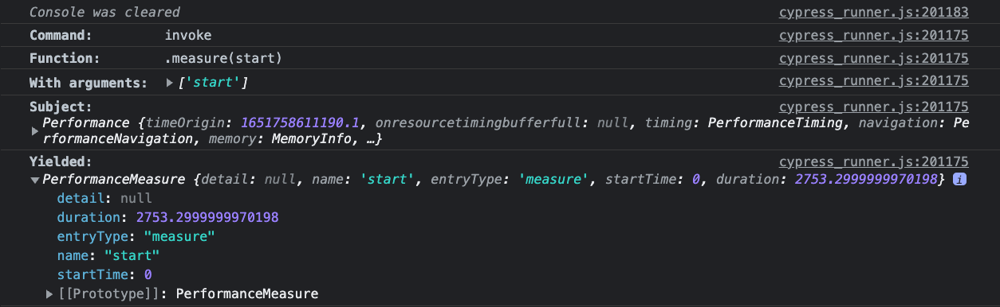

There are many ways to measure performance. In today’s post I want to talk about one of the most simple. Imagine a following scenario:

1. user clicks a button
2. modal window appears

Our test may look something like this:

```ts
  cy.visit('/board/1')

  // wait for loading to finish
  cy.getDataCy('loading')
    .should('not.exist')

  cy.getDataCy('card')
    .click()

```

This modal window may fetch some data from server, reorder or filter it. Additionally it may perform some other actions such as render images etc. All of these actions take some time and as testers, we want to make sure that the result will not take too long.


## performance.mark() API
In [all of the current browsers](https://developer.mozilla.org/en-US/docs/Web/API/Performance/mark#browser_compatibility) a `performance` API is available on `window` object. We can access this API by using `cy.window()` function and then calling a method. To start measuring the performance, we can create a mark that will label the start of our measurement.

```ts {7-9}
  cy.visit('/board/1')

  // wait for loading to finish
  cy.getDataCy('loading')
    .should('not.exist')

  cy.window()
    .its('performance')
    .invoke('mark', 'modalOpen')

  cy.getDataCy('card')
    .click()
```

The highlighted part of our code does actually the exact same thing as if we were to type `window.performance.mark('modalOpen')` in our DevTools console. The `modalOpen` is just a label, and can be named anything.

## performance.measure() API
Now that we have labeled the start of our metric, let’s perform the next steps. When we click on the card, it opens modal window. First, we want to make sure that we have reached the desired result. We can check that by making an assertion on the modal window visibility:

```ts {14-15}
  cy.visit('/board/1')

  // wait for loading to finish
  cy.getDataCy('loading')
    .should('not.exist')

  cy.window()
    .its('performance')
    .invoke('mark', 'modalOpen')

  cy.getDataCy('card')
    .click()

  cy.getDataCy('card-detail')
    .should('be.visible')
```

After that, we can call `performance.measure()`function to make our measurement. Basically, we are pressing a button on a stopwatch here. The argument of the `measure` function will be our `modalOpen` label. The reason for passing this argument is that we can actually add multiple labels into our test and we need to specify which one to measure. To call the measure function we basically perform a very set of Cypress functions as before:

```ts {17-19}
  cy.visit('/board/1')

  // wait for loading to finish
  cy.getDataCy('loading')
    .should('not.exist')

  cy.window()
    .its('performance')
    .invoke('mark', 'modalOpen')

  cy.getDataCy('card')
    .click()

  cy.getDataCy('card-detail')
    .should('be.visible')

  cy.window()
    .its('performance')
    .invoke('measure', 'modalOpen')
```

The invoke command is going to yield an object with all kinds of results:



Within this command, we can pick a property from this object using `.its()` command. Since we don’t need retryability, we can set timeout to 0 and make our assertion immediately. Let’s make an assertion that the modal should not load longer than 2 seconds (2000 in milliseconds).

```ts {20-21}
  cy.visit('/board/1')

  // wait for loading to finish
  cy.getDataCy('loading')
    .should('not.exist')

  cy.window()
    .its('performance')
    .invoke('mark', 'modalOpen')

  cy.getDataCy('card')
    .click()

  cy.getDataCy('card-detail')
    .should('be.visible')

  cy.window()
    .its('performance')
    .invoke('measure', 'modalOpen')
    .its('duration', { timeout: 0 })
    .should('be.lessThan', 2000)
```

## Creating a custom command
Now that we know what to do, we can create a custom command out of this. There’s a lot of TypeScript going on, so let me break down what’s happening here. Lines 1-9 is a type declaration. This is how we tell TypeScript compiler that we have added a new `cy.mark()` command to the library of `cy` commands. The library is called `Chainable`, and contains all `cy` commands. This library is part of a bigger whole - `namespace Cypress`.

Lines 11 - 29 is a function that contains our chain of commands from previous example. In addition to that, I have hidden the logs of our three commands and added my own log which you can see on lines 15 - 24. 

Finally, on line 31, we are adding this function to the Cypress library. While lines 1-9 add our command to the Cypress namespace that our TypeScript compiler can recognize, `Cypress.Commands.addAll()` function will add it to the Cypress itself. I usually store my custom commands to `cypress/support/commands/` folder and do an `import ../commands/mark.ts` inside `cypress/support/index.ts` file.

```ts [support/commands/mark.ts]
declare namespace Cypress {
  interface Chainable<Subject = any> {
      /**
       * Add a measurment marker. Used with cy.measure() command
       * @example cy.mark('modalWindow')
       */
       mark: typeof mark
  }
}

const mark = (markName: string): Cypress.Chainable<any> => {

  const logFalse = { log: false }

  Cypress.log({
    name: 'mark',
    message: markName,
    consoleProps() {
      return {
        command: 'mark',
        'mark name': markName
      }
    }
  })

  return cy.window(logFalse)
    .its('performance', logFalse)
    .invoke(logFalse, 'mark', markName)
}

Cypress.Commands.addAll({ mark })
```

Similarly, we can add the `cy.measure()` command as well:
```ts [support/commands/measure.ts]
declare namespace Cypress {
  interface Chainable<Subject = any> {
      /**
       * Add a measurment marker. Used with cy.measure() command
       * @example cy.measure('modalWindow')
       */
       measure: typeof measure
  }
}

const measure = (markName: string): Cypress.Chainable<number> => {

  const logFalse = { log: false }

  let measuredDuration: number
  let log = Cypress.log({
    name: 'measure',
    message: markName,
    autoEnd: false,
    consoleProps() {
      return {
        command: 'measure',
        'mark name': markName,
        yielded: measuredDuration
      }
    }
  })

  return cy.window(logFalse)
    .its('performance', logFalse)
    .invoke(logFalse, 'measure', markName)
    .then( ({ duration }) => {
      measuredDuration = duration
      log.end()
      return duration
    })
}

Cypress.Commands.addAll({ measure })
```

A small difference from our `cy.mark()` is that this time our return type will be `number`, because the our function will return a number. Also, instead of using `.its()` function, we are returning it from `.then()` function as we want to use it in our console command detail as well. If this is a lot of new terms, I suggest checking out this post about [improving custom Cypress command I’ve made earlier](/improve-your-custom-command-logs-in-cypress).

## Performance testing in Cypress
Whenever we do performance testing of any kind, we need to pay close attention to the environment we are testing on. Are we in production? Is it currently under heavy load? If on staging server, is it 1:1 with production or are we testing a scaled down version? Are we using browser for perfomance testing? Which one? Which version? All of this and more questions need to be asked to provide context for the performance metrics. 

In our context, we are running inside a browser that has two iframes opened. One for our application and one for Cypress script. This may have effect on our testing and it is not slight. Cypress docs [warn about this in their docs](https://docs.cypress.io/faq/questions/using-cypress-faq#Can-Cypress-be-used-for-performance-testing). This doesn’t mean that measuring performance in Cypress is useless. It just means that we need to take the context into account when looking at the metrics.