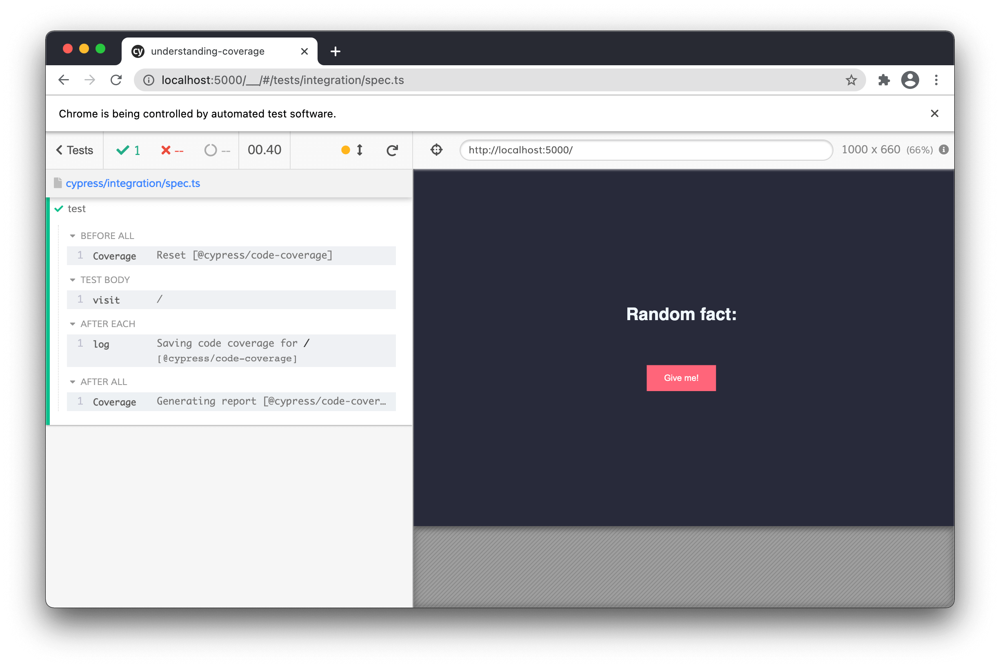
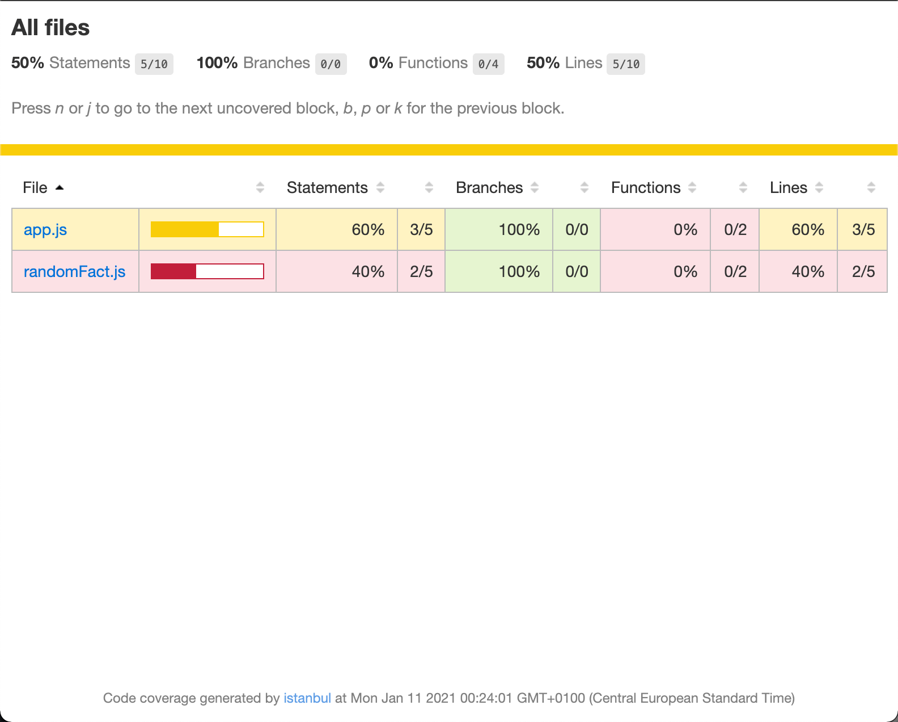

Code coverage is one of those few things that doesn’t come right out of the box with Cypress. To set up code coverage, there’s some web development knowledge that one must understand first. I struggled with this initially, but last couple of weeks I was finally able to wrap my head around it.

I wrote this blog for those that are beginning to learn about how web apps are built, so if you don’t need a demonstration on what Browserify, Babel or Webpack do, you can scroll over to Part 4. If you are looking for ways how to set up code coverage with Cypress, I recommend you instead visit this [great piece of documentation](https://docs.cypress.io/guides/tooling/code-coverage.html#Introduction), or look into at the [webinar made by Cypress team](https://www.youtube.com/watch?v=C8g5X4vCZJA) on this topic. If you are confused by these, feel free to come back, see if it helps.

## Part 1 - what are web apps made of?
As it’s almost usual on this blog, [there’s a repo you can clone](https://github.com/filiphric/understanding-coverage) and follow along this blog. Our app is super simple, it’s just a site with a button that generates a random and totally useless fact. Knowing these provides absolutely no value to your life. But pulling these facts in a conversation will certainly make you more annoying. So there’s that.

This app, contains three files, as is usual for web apps:
```plaintext
index.html
app.js
style.css
```
Each plays different part in our app. Our `css` and `js` files are linked together in our html file, inside the `<head>` tag:
```html [index.html]
<head>
  <link rel="stylesheet" href="style.css">
  <script src="app.js" defer></script>
</head>
```

Our `app.js` is responsible for the "fun" part on our site. Clicking on the button will reveal our random fact. The file looks like this:
```js [app.js]
const $ = document.querySelector.bind(document)

$('button').addEventListener('click', () => {
  $('p').textContent = 'A rainbow can be seen only in the morning or late afternoon. It can occur only when the sun is 40 degrees or less above the horizon.'
})
```
Our page contains an empty paragraph. Once we click on our button, it reveals a fact about rainbows. A single fact is not that random and makes our site boring. Or at least even more boring than it currently is. Luckily for us, there’s an [API for random useless facts](https://uselessfacts.jsph.pl/). You read that right, I’m not kidding. So let’s use this API. To do that, I’m going to create another file, that is going to fetch our API for a random useless fact.

```js [randomFact.js]
const axios = require('axios')

module.exports.randomFact = async () => {
  const res = await axios.get('https://uselessfacts.jsph.pl/random.json?language=en')
    .then(function (response) {
      return response.data.text
  })

  return res;
}
```
We are going to require our `randomFact.js` module inside our our `app.js` and use the function to fetch a random fact from our API:
```js {2} [app.js]
const $ = document.querySelector.bind(document)
const { randomFact } = require("./randomFact");

$('button').addEventListener('click', () => {
  randomFact().then( (text) => {
      $('p').textContent = text
  });
})
```
## Part 2 - bundling JavaScript files
When we do this though, and open our app in browser, an error appears: `require is not defined`. This is because require does not exist in browser context. This feels like we cannot include multiple files in our app, but that’s not actually the case. Since we want to use our `randomFact.js`, the common solution is to bundle up our `app.js` file and everything it references. We will create a single file that we are going to reference in hour html `<head>` tag.

For doing this process, we are going to use a tool called [Browserify](http://browserify.org/). It will convert our `app.js` file to a bundle that will link everything into a single file in a browser friendly way. We’ll do that using following command:
```bash
npx browserify app/app.js -o app/bundle.js
```
The output (`-o`) of our `app.js` file will be a new file called `bundle.js`. From now on, we will use our `bundle.js` in our html:
```html {3} [index.html]
<head>
  <link rel="stylesheet" href="style.css">
  <script src="bundle.js" defer></script>
</head>
```
## Part 3 - transforming JavaScript files
Our app is now working, which is great. If we take a look into the `bundle.js` file, we’ll that it contains our `app.js` code, our `randomFact` code and our `axios` module code which we use in our `randomFact` function.

Now that we have bundled our code, we can further modify it. We could e.g. minify our bundle. In other words, we could take out all the white spaces, delete comments and use short variable names. This is especially useful for big projects with hundreds of `js` files. Another example of such modification may be making our code compatible with older browsers. You can often find different tools accomplishing these tasks. If you ever heard of Babel, Webpack or Browserify - that’s what these tools do.

This bundling and transforming is often referred to as **building** the app. For code coverage, we will build a transformed version of our application. But instead of making it smaller, we are going to make it bigger.

## Part 4 - what is instrumentation?
I think [Amir Rustamzadeh](https://twitter.com/amirrustam) explained it pretty well, in the [webinar about code coverage with Cypress](https://www.youtube.com/watch?v=C8g5X4vCZJA). Go watch it. With [Gleb Bahmutov](https://twitter.com/bahmutov), they did a great job of explaining how the whole thing actually works.

I’ll give you just a very brief explanation of how code coverage works. Let’s say we have a very simple function that adds a number, like this:
```js
const addition = (a, b) => {
  return a + b
}
```
With code coverage, we want to collect the data on whether this function was actually called. The most simple way to find out would be to put a counter inside our function. Whenever we now call our function, our `i` variable will increment.

```js {1, 4}
let i = 0;

const addition = (a, b) => {
  i++
  return a + b
}

addition(1,2)
console.log(i) // 1

addition(3,5)
console.log(i) // 2

addition(14,8)
console.log(i) // 3
```
This is the same principle on how code coverage works! It’s really that simple. It counts which functions were called and which were omitted.

Adding these counters manually is of course not the way to go. That’s where the process of building our app comes in. We can actually transform our app to include these counters inside every function and condition in our app. Browserify is actually not built for this kind of task, but we can use Babelify, which is a Babel plugin for Browserify. Babelify will transform our code using Babel.

Babel is actually a really powerful tool that can transform code in many ways. The most basic way of using Babel is to transform your code to be compatible with older browsers like Internet Explorer 11. This transformation is needed when you use ES6 syntax (e.g. arrow functions or `async` functions). Babel is highly configurable and supports various plugins which can help you transform code in many different ways. One plugin that will be using with babel is called `babel-plugin-istanbul`.


To configure our Babel plugin, we’ll add following configuration to a `babel.config.js` file:
```js [babel.config.js]
module.exports = {
  'presets': [
    [
      '@babel/preset-env'
    ]
  ],
  plugins: [
    ['babel-plugin-istanbul', {
      extension: ['.js']
    }]
  ]
};
```


If your head is spinning right now, don’t worry. Imagine your code going to a couple of filters. Kind of like an item in a factory starting on one end and finishing on the other.

Your `app.js` will enter >>> **Browserify** where all of the `js` files are bundled into `bundle.js`.

After this is done, our `bundle.js` file is processed by >>> **Babel**, which will transform our code using >>> `babel-plugin-istanbul`.

This last plugin will take our `bundle.js` file and instruments our code (adds function call counters) into the final `bundle.js` file.

We can actually see it quite clearly when we call our Browserify command with a transform (`-t`) option.
```bash
npx browserify app/app.js -t babelify -o app/bundle.js
```
Take a look into `bundle.js` file and see how different it has become since we last bundled it with Browserify.

## Part 5 - setting up Cypress
Believe it or not, our app is now instrumented. The data about which function has been called is now being collected. If you open the `index.html` file and enter `window.__coverage__` to the browser, you can actually see that we have an object that references our `app.js` and our `randomFact.js` file. This is where our coverage data is stored. In fact, when you click on our "Give me" button in our app and call `window.__coverage__` again, you can see that data inside it changed. Not very readable, but it’s there.

We can now tell Cypress to collect this data and generate report for us. To do that, you need to install [Cypress code coverage plugin](https://github.com/cypress-io/code-coverage). Installation is pretty standard and readme page should be sufficient enough for explanation. As mentioned, this plugin does not instrument our code, but fortunately, we have already done that in Part 4.

When we now open Cypress and run a simple test with `.visit()` command inside, you can see that there are multiple new commands present in our test.


Not only that. After we ran our test, there’s a new folder called `coverage` in the root of our project. This contains a HTML report of our code coverage. Just by opening our app we were able to get to 50% coverage of our app. Notice that our coverage report also shows the original names of our files, `app.js` and `randomFact.js`, which makes our report very good to navigate through.



Inside this report we can further look into each of our files and each of our lines. We can see if these lines of code were actually called by our e2e test. Since our test only opened our app, we need to add a click on our button too to cover the whole story. Adding this will make our app 100% covered, since there is not much else happening in our app.

## Part 6 - what does code coverage tell us?
Now that we are all set up, let’s get a little philosophical for a moment. Should we strive for 100% coverage? It sure sounds nice, but getting 100% code coverage does not mean we are bug free. Notice that there is not a single assertion in this test:
```ts
it('generates a random fact', () => {

  cy
    .visit('/')

  cy
    .get('button')
    .click()

});
```
But there’s a ton that can happen in our app that might result in a bad user experience. Our layout might be broken, our characters would not be rendered properly our API might not work, you name it. And yet, we have achieved 100% coverage with our test.

We are „taking a walk“ through our app, but not really making assertions about values it gives us back. This is a good thing to have in mind when writing tests with test coverage.

Code coverage can help us navigate through project and identify places that are not covered by tests. It is a great guiding tool which does not take too long to set up and provides a tremendous value.

Hope you liked this post, consider sharing it with your friends. If you have questions, make sure you join my [Discord server](https://discord.com/invite/3MdvPfT) where we are gathering a community of Cypress learners.