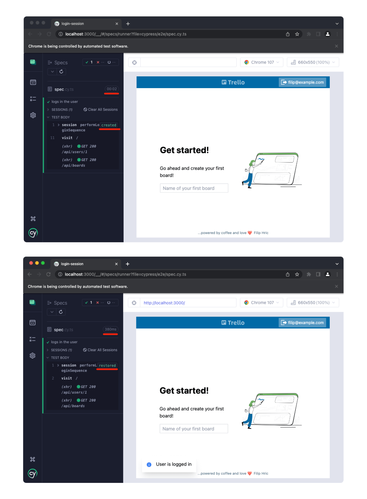

With many test automation efforts, dealing with login is the first hurdle to overcome. This can in itself be quite the challenge.

A most common way to solve a login flow is to simply go through this as a normal user would. Let’s see how this will look in our app:

```ts
cy.visit('/login')
cy.get('[data-cy=login-email]').type('filip@example.com')
cy.get('[data-cy=login-password]').type('i<3slovakia!')
cy.get('[data-cy=login-submit]').click()
cy.location('pathname').should('eq', '/')
```

Cypress tries to clear browser data inbetween tests, which leads to the need of logging in before every rest. We can either do this by using `beforeEach()` hook or [by using cookies api](/cypress-basics-where-did-my-cookies-disappear) to ignore deleting certain cookies from our app.

## Abstracting login into page object
It makes sense to abstract the login sequence into a separate entity. A go to solution is a page object. In many cases it might look something like this:

```ts
export class LoginPage {

  username: string
  password: string
  log_in: string

  constructor() {
    this.username = '[data-cy=login-email]'
    this.password = '[data-cy=login-password]'
    this.log_in = '[data-cy=login-submit]'
  }

  /**
   * opens a login page
   */
  load() {
    cy.visit('/login')
  }

  /**
   * fills in username, password and submits form
   * @param username username of user to log in
   * @param pass password of the user
   */
  login(username: string, pass: string) {

    cy.get(this.username).type(username)
    cy.get(this.password).type(pass)
    cy.get(this.log_in).click()
    cy.location('pathname').should('eq', '/')
  }

}
```

This way we can easily login before every test and arrange our test before making actions in our test scenario. If you want to do this globally, you can just add a global `beforeEach()` hook into your support file:

```ts [support/e2e.ts]
import { LoginPage } from '../support/models/LoginPage'

beforeEach( () => {

  loginPage.load()
  loginPage.login('filip@example.com', 'i<3slovakia!')

})
```

## Using a custom command
I personally prefer using custom commands for widely used functions like this. The big advantage of custom commands is that they become part of your Cypress library. Because of this, they are easy to find, and also play well with Cypress’ chaining syntax. You can also create DOM snapshots for debugging and many more. I write about these in more detail in [my previous blogpost](/improve-your-custom-command-logs-in-cypress). A custom command for a login might look like this:

```ts
declare global {
  namespace Cypress {
    interface Chainable {
      /**
       * Logs in with a given user
       * @param email email of the user you want to log in
       * @param password user passwird
       * @example
       * cy.login('filip@example.com', 'i<3slovakia!')
       *
       */
      login: typeof login
    }
  }
}

const login = (email: string, password: string) => {

  cy.visit('/login')
  cy.get('[data-cy=login-email]').type(email)
  cy.get('[data-cy=login-password]').type(`${password}`)
  cy.get('[data-cy=login-submit]').click()
  cy.location('pathname').should('eq', '/')

};

Cypress.Commands.addAll({ login })

```

Lines 1 - 15 are adding our custom command to the Cypress library by expanding TypeScript definitions. Lines 17 - 24 is a function definition that contains the login sequence. Finally, we add our function on line 26. Similarly as with our page object example, we can add our newly created `cy.login()` command to a global `beforeEach()` hook and make our test log in before every `it()` block.

```ts [support/e2e.ts]
beforeEach( () => {
  cy.login('filip@example.com', 'i<3slovakia!')
})
```

## Programmatic login
However, using UI is not the most effective way and will definitely take a performance toll. The second option is to log in programatically. But of course, this is often easier said than done. With programmatic login (or any kind of login for that matter), there are 3 parts present:

1. server
2. frontend
3. browser

On log in, **server** provides data (usually in form of token), and then **frontend** saves it to **browser** (usually in form of cookies). To be able to log in programmatically, you need to understand how your app is sending data to the server and how it handles the response. Basically, you need to know *exactly* what happens when user fills in the information and hits "Log In" button.

In other words, you will be re-creating that login in your test. It’s pretty darn fast once you figure it out, but not easy. Especially if you need to deal with [3rd party login](https://filiphric.com/google-sign-in-with-cypress), OAuth flows and other more advanced login methods. There are many useful guides in [Cypress docs for this](https://docs.cypress.io/guides/end-to-end-testing/google-authentication).

## Using cy.session()
But there’s actually no need to figure out login and be effective. With `cy.session()` command, you can use your UI just once for your whole test suite.

`cy.session()` command came out with version 8.2.0. It was one of the releases that did not get as much attention as they should in my opinion. It’s one of the most effective things you can do in terms of logging in. Let me give you a simple example of the usage and show you how it works. We will use the custom command shown above for this.

```ts
it('logs in the user', () => {

  cy.session('performLoginSequence', () => {
    cy.login('filip@example.com', 'i<3slovakia!')
  })

  cy.visit('/')
})
```

In our test, we have wrapped our `cy.login()` command inside `cy.session()` command. This is giving Cypress the information, that whatever runs inside the `cy.session()` callback (in other words, between line 3 and 5) should be remembered as a session. When we run this test again, instead of going through the login, our session will be restored. Notice the following image that shows first run (image above) and second run (image below).



As you can see, the second run is going to **restore** the session, while the first one is **creating** it. You can also notice how the second test takes just a fragment of the time compared to first test.

The way it works goes something like this: 

1. Cypress runs a test
2. when it stumbles upon `cy.session()` it will make a decision
   1. Session with name `performLoginSequence` does not exist, I will run the code inside `cy.session()` callback
   2. Session with name `performLoginSequence` exists, I will restore the session

What restoring a session essentially means is recovering all of the browser cookies, local storage and session storage that was present in browser after user was logged in. Remember how we talked about programmatic login and three parts of the login flow? Well, `cy.session()` takes care of the **browser** part, which means you don’t need to worry about the **frontend** and **server** part.

## Applying cy.session() to the whole project
We can now take the session to the whole project by inserting the `cy.session()` sequence into the support file:

```ts {5} [support/e2e.ts] 
beforeEach( () => {
  cy.session('loginTestingUser', () => {
    cy.login('filip@example.com', 'i<3slovakia!')
    }, { 
    cacheAcrossSpecs: true
  })
  
}) 
```
Notice the `cacheAcrossSpecs` option on line 5. This will make login just once for the whole test run. Imagine every login sequence takes 2 second to finish. If you had 100 tests that log in, you just reduced more than 3 minutes from your test run!

## Creating multiple sessions
Let’s say you have multiple users you want to test your UI against. The first argument of `cy.session()` command is actually an alias for the session. This means we can create multiple sessions and give them different names. The easiest way to achieve this is to flip the order of how we write our commands. Instead of wrapping out `cy.login()` command inside `cy.session()`, let’s make `cy.session()` a part of our `cy.login()` command, like this:

```ts {17}
declare global {
  namespace Cypress {
    interface Chainable {
      /**
       * Logs in with a given user
       * @param email email of the user you want to log in
       * @param password user passwird
       * @example
       * cy.login('filip@example.com', 'i<3slovakia!')
       *
       */
      login: typeof login
    }
  }
}

const login = (email: string, password: string) => {

  cy.session(email, () => {
    cy.visit('/login')
    cy.get('[data-cy=login-email]').type(email)
    cy.get('[data-cy=login-password]').type(`${password}`)
    cy.get('[data-cy=login-submit]').click()
    cy.location('pathname').should('eq', '/')
  }, { 
    cacheAcrossSpecs: true
  })

};

Cypress.Commands.addAll({ login })

```

Notice on line 17, we are giving our session the same name as the email we pass into the `cy.login()` function. This means that every user wi log in with is going to create their own session. In other words, no matter how many logins we do with different users, each of them will get logged in just once.

## Why use a custom command instead of page object - opinion
You may have heard me saying contradicting things on page object model in the past. I critisize page object model for how it’s being used, but also say that it is not an antipattern. While it makes sense to make abstractions, it really matters how you do them. There’s a big push for using page object model in order to create abstractions and DRY code (DRY = don’t repeat yourself). While I’m all for DRY code, I think as testers we should aim for DRY test execution as well.

Page objects are often used to set up a state of your application. Basically, if you want to test "B", you need to get there by doing "A". If that "A" is a login, you might need to perform it in all of your tests. `cy.session()` allows you to limit the amount of times you do "A". This does not have to be a login, you can actually do your setup by calling a bunch of API endpoints or perform some other setup actions.

Using custom commands or custom functions makes more sense than by using a UI page object. But even if you decide to do the setup via UI, you can save a lot of time by using `cy.session()`. You would have a hard time using `cy.session()` with a page object. It’s not impossible, but essentially you might need to put your whole login action into a single function, where you visit, fill and submit login form. That page object would look something like this:

```ts
export class LoginPage {

  username: string
  password: string
  log_in: string

  constructor() {
    this.username = '[data-cy=login-email]'
    this.password = '[data-cy=login-password]'
    this.log_in = '[data-cy=login-submit]'
  }

  /**
   * fills in username, password and submits form
   * @param username username of user to log in
   * @param pass password of the user
   */
  loginAndFill(username: string, pass: string) {

    cy.session(username, () => {
      cy.visit('/login')
      cy.get(this.username).type(username)
      cy.get(this.password).type(pass)
      cy.get(this.log_in).click()
      cy.location('pathname').should('eq', '/')
    }, { 
      cacheAcrossSpecs: true
    })
  }

}
```

In this case, our page object contains just a single function and it would not make sense to add any more as this would break the session. Because of this, it makes more sense to choose a simpler pattern, like custom command or a standalone function module that you import to your test.

Hopefully you enjoyed this blogpost, let me know what you think by raching out to me on [LinkedIn](https://www.linkedin.com/in/filip-hric-11a5b1126/), [Twitter](https://twitter.com/filip_hric/), or on my [Discord](https://filiphric.com/discord) server.